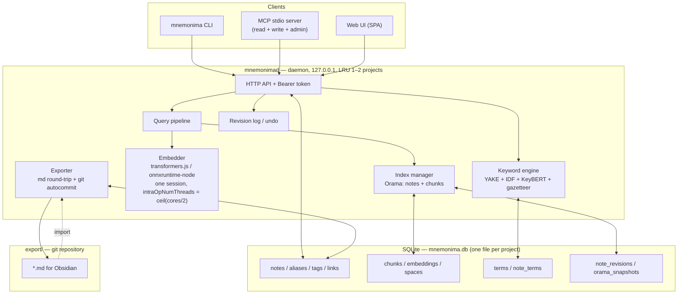

# mnemonima — design document (v0.2)

> Status: **stages 0–9 shipped; stage 10+ (post-MVP) is what is left.** See
> §15 for the board and §18 for where the work stands.
> Changes relative to v0.1 record the decisions taken in discussion — see §1.2.
> This is the specification *and* the roadmap, so it is kept consistent with the
> state of the repository: where a section describes something that was later
> built differently, the section is corrected rather than left as a wish.
> Everything in this repository is English: this document, the code, schemas,
> configs, notes, UI strings, logs and commits. See §11.

---

## 1. Overview

### 1.1 What we are building

A local semantic search engine over a personal knowledge base organised as a
graph of markdown notes. The primary consumer is **AI agents**, the secondary
one is a human through the web UI.

Four faces of one core:

| Face | For whom | Form |
|---|---|---|
| CLI | humans and scripts | `mnemonima find -p "project" -q "shaders introducing"` |
| MCP | agents (Claude Code and others) | stdio, full access: read, write, administration |
| HTTP API | the UI, integrations | a local daemon on `127.0.0.1` |
| Web UI | humans | graph, editor, search lab |

### 1.2 Key architectural decisions

| # | Decision | Rationale |
|---|---|---|
| **A1** | **SQLite is the source of truth.** Note bodies, metadata, chunks, vectors and revisions all live in one database file per project. | Transactions, integrity, a single transportable file, schema migrations, recovery after a crash. |
| **A2** | **Orama is the search layer in RAM**, hydrated from SQLite when the daemon starts. | SQLite has no hybrid BM25 + vector search out of the box; Orama does. Splitting "storage / search" is not a conflict, it is the normal pairing. |
| **A3** | **Markdown export is a full round trip plus an automatic git commit.** | Obsidian and git history as an outer layer, with no race for the source of truth. |
| **A4** | **Ids are immutable.** There is no rename. Extra surface forms go in a separate searchable `aliases` field. | A link to an external or non-existent id is preserved as written: if the operator referenced it, there was a reason. |
| **A5** | **Backlinks are derived** from the note body, not stored as an editable field. | One source of truth. Materialising them into frontmatter happens only on export. |
| **A6** | **Multi-strategy chunking:** one text is cut by two chunkers (`fine` / `coarse`), and search runs over both levels. | Small chunks catch precise facts, large ones catch the general sense. |
| **A7** | **Vector search is brute force in Orama; ANN is not needed.** | At a ceiling of 10k notes that is ~160k chunks → 0.3–0.8 s. The user's budget is 10 s. A tenfold margin. |
| **A8** | **Keywords = automatic extraction + a manual gazetteer.** Three independent sliders plus a global switch. | Manual terms always win; the automatic ones are adjustable. |
| **A9** | **MCP with full access** (write + administration) → revisions and `undo` become mandatory. | Direct consequence: a co-author agent without a change history is dangerous. |
| **A10** | **LRU of 1–2 projects in RAM**, the rest are evicted on a timeout. | A budget of 2–4 GB. |
| **A11** | **Graph in the UI: viewing plus link creation by dragging.** There is no edge deletion with the mouse. | Creation appends a link to a dedicated `## Related` section — predictable and reversible. Deletion would mean cutting a wikilink out of the middle of a sentence. |
| **A12** | **Attachments are paths only.** Files are not copied, not indexed, not put in the database. | "Markdown only" stays literal, the database does not swell, and the git export does not drag binaries along. |
| **A13** | **Cross-encoder rerank is post-MVP.** The stage goes into the code straight away, is switched on by a checkbox, and is implemented later. | The pipeline will not have to be rewritten, and there is no second model in memory at the start. |
| **A14** | **Public npm, but later.** We build by the rules of a public package (MIT, semver, strict defaults); the early stages use `npm link`. | The public API is frozen once it has settled, not at stage 2. |

### 1.3 Resource budget (set by the operator)

- **Search latency:** up to 10 s is acceptable (the work is in the background).
  The target is < 1 s.
- **CPU:** no more than half the cores. `intraOpNumThreads = ceil(cores / 2)`,
  and indexing runs at lowered priority
  (`os.setPriority(PRIORITY_BELOW_NORMAL)`).
- **RAM:** 2–4 GB for the daemon.
- **Scale:** starting at up to 1000 notes, a ceiling of ~10 000.

---

## 2. Architecture



### 2.1 Repository layout

A monorepo (pnpm workspaces), published as a single `mnemonima` package:

```
packages/
  core/      # md parser, chunkers, keyword engine, embedder, VectorStore, pure logic
  store/     # SQLite: schema, migrations, repositories, revisions
  engine/    # orchestration: indexing, search, authoring, bridge, undo
  daemon/    # HTTP, LRU project manager, exporter, git; serves the UI bundle
  mcp/       # MCP stdio adapter on top of the HTTP API
  cli/       # thin client plus daemon auto-spawn
  ui/        # Vite SPA, built to static files, served by the daemon
```

Dependencies point one way: `core <- store <- engine <- daemon <- mcp <- cli`.

**`engine` was added during stage 1** and is not in the original list of six.
That list put the search pipeline in `core` and persistence in `store`, which
leaves no home for code that legitimately needs both — the indexing pipeline and
search are exactly that, so they live in `engine`.

**`ui` is a build, not a library.** It is a Vite bundle with no Node entry
point; the daemon depends on it only to resolve the package directory and serve
`dist/` as static files. sigma, graphology and CodeMirror are its
devDependencies, because Vite compiles them in — a runtime dependency would make
`npm i -g mnemonima` install a graph library it never loads.

---

## 3. Data model

### 3.1 SQLite schema

One file per project. `PRAGMA journal_mode = WAL`, `foreign_keys = ON`.

```sql
-- ── housekeeping ────────────────────────────────────────────────────────
CREATE TABLE meta (
  key   TEXT PRIMARY KEY,        -- schema_version, project_name, id_prefix,
  value TEXT NOT NULL            -- id_counter, active_space, export_path, ...
);

-- ── notes ──────────────────────────────────────────────────────────────
CREATE TABLE notes (
  id         TEXT PRIMARY KEY,   -- 'SL-0042' — IMMUTABLE, renaming is forbidden
  title      TEXT NOT NULL,
  body       TEXT NOT NULL,      -- markdown, the source of truth
  body_hash  TEXT NOT NULL,      -- sha256 of the normalised body
  outline    TEXT,               -- generated: a table of contents from the headings
  lang       TEXT NOT NULL DEFAULT 'en',
  status     TEXT NOT NULL DEFAULT 'active',   -- active | draft | archived
  rev        INTEGER NOT NULL DEFAULT 1,
  created_at INTEGER NOT NULL,
  updated_at INTEGER NOT NULL
);

-- "Additional occurrences": extra surface forms that take part in search
CREATE TABLE aliases (
  note_id TEXT NOT NULL REFERENCES notes(id) ON DELETE CASCADE,
  alias   TEXT NOT NULL,
  source  TEXT NOT NULL DEFAULT 'manual',      -- manual | auto
  PRIMARY KEY (note_id, alias)
);
CREATE INDEX idx_aliases_alias ON aliases(alias);

CREATE TABLE tags (
  note_id TEXT NOT NULL REFERENCES notes(id) ON DELETE CASCADE,
  tag     TEXT NOT NULL,
  PRIMARY KEY (note_id, tag)
);

-- ── graph ──────────────────────────────────────────────────────────────
CREATE TABLE links (
  src      TEXT NOT NULL REFERENCES notes(id) ON DELETE CASCADE,
  dst      TEXT NOT NULL,        -- NO FK: dangling links are preserved as written
  anchor   TEXT,                 -- display text from [[SL-0042|anchor]] → a keyword signal
  heading  TEXT,                 -- the anchor from [[SL-0042#Uniforms]]
  kind     TEXT NOT NULL,        -- wikilink | mdlink | manual
  resolved INTEGER NOT NULL,     -- 0 = dst does not exist in the project
  PRIMARY KEY (src, dst, COALESCE(anchor,''))
);
CREATE INDEX idx_links_dst ON links(dst);   -- backlinks = SELECT src WHERE dst = ?

-- ── term dictionary ────────────────────────────────────────────────────
CREATE TABLE terms (
  id       INTEGER PRIMARY KEY,
  term     TEXT NOT NULL UNIQUE,
  lemma    TEXT NOT NULL,
  source   TEXT NOT NULL,        -- manual | auto
  pinned   INTEGER NOT NULL DEFAULT 0,   -- manual, never cut from the results
  blocked  INTEGER NOT NULL DEFAULT 0,   -- block list for noise
  weight   REAL NOT NULL DEFAULT 1.0,
  df       INTEGER NOT NULL DEFAULT 0,   -- in how many notes it occurs
  created_at INTEGER NOT NULL
);

CREATE TABLE note_terms (
  note_id TEXT NOT NULL REFERENCES notes(id) ON DELETE CASCADE,
  term_id INTEGER NOT NULL REFERENCES terms(id) ON DELETE CASCADE,
  kind    TEXT NOT NULL,         -- keyword | phrase
  score   REAL NOT NULL,         -- the result of fusing the extractors
  source  TEXT NOT NULL,         -- manual | auto
  PRIMARY KEY (note_id, term_id)
);

-- ── embedding spaces ───────────────────────────────────────────────────
CREATE TABLE spaces (
  id              TEXT PRIMARY KEY,  -- hash of {model,dim,prefixes,norm,chunker_ver,strategies}
  model           TEXT NOT NULL,
  dim             INTEGER NOT NULL,
  chunker_version TEXT NOT NULL,
  config_json     TEXT NOT NULL,
  is_active       INTEGER NOT NULL DEFAULT 0,
  created_at      INTEGER NOT NULL
);

CREATE TABLE chunks (
  id           INTEGER PRIMARY KEY,
  space_id     TEXT NOT NULL REFERENCES spaces(id) ON DELETE CASCADE,
  note_id      TEXT NOT NULL REFERENCES notes(id) ON DELETE CASCADE,
  strategy     TEXT NOT NULL,    -- fine | coarse
  ord          INTEGER NOT NULL,
  heading_path TEXT,             -- 'Shaders > Fragment stage'
  kind         TEXT NOT NULL,    -- prose | code
  text         TEXT NOT NULL,
  text_hash    TEXT NOT NULL,    -- the key an embedding is reused by
  tokens       INTEGER NOT NULL
);
CREATE INDEX idx_chunks_note ON chunks(space_id, note_id);
CREATE INDEX idx_chunks_hash ON chunks(space_id, text_hash);

-- Keyed by (space, text_hash), NOT by chunk_id: identical text in different
-- notes and in different strategies is embedded once.
CREATE TABLE embeddings (
  space_id  TEXT NOT NULL REFERENCES spaces(id) ON DELETE CASCADE,
  text_hash TEXT NOT NULL,
  vec       BLOB NOT NULL,       -- Float32Array, dim*4 bytes, L2 normalised
  PRIMARY KEY (space_id, text_hash)
);

-- ── revisions and snapshots ────────────────────────────────────────────
CREATE TABLE note_revisions (
  note_id    TEXT NOT NULL,
  rev        INTEGER NOT NULL,
  title      TEXT NOT NULL,
  body       TEXT NOT NULL,
  op         TEXT NOT NULL,      -- create | update | delete | import | adopt
  author     TEXT NOT NULL,      -- cli | ui | mcp:<client-name> | import | agent:<id>
  created_at INTEGER NOT NULL,
  PRIMARY KEY (note_id, rev)
);

CREATE TABLE orama_snapshots (
  space_id      TEXT NOT NULL,
  kind          TEXT NOT NULL,   -- notes | chunks
  index_version TEXT NOT NULL,   -- the package's index schema version
  blob          BLOB NOT NULL,
  created_at    INTEGER NOT NULL,
  PRIMARY KEY (space_id, kind)
);
```

**Not built:** an FTS5 table `notes_fts(body, title)` was pencilled in for the
`exact` mode and for `doctor`. It turned out to be unnecessary — `exact` greps
the note bodies directly (§8.3), and at this scale that is fast enough that a
second copy of every body in the database would buy nothing. The main search
never went through it in any case.

### 3.2 Mapping of your original schema

| Your field | Where it lives | Comment |
|---|---|---|
| ID | `notes.id` | immutable, `PREFIX-NNNN` |
| Embedding Model ID | `spaces.model` via `chunks.space_id` | on the space, not on the note |
| Keywords | `note_terms` (`kind='keyword'`) | manual + auto, §7 |
| Key phrases | `note_terms` (`kind='phrase'`) | manual + auto, §7 |
| Additional occurrences | `aliases` | a searchable field with a high boost |
| Embeddings | `embeddings.vec` (BLOB) | multiple vectors through `chunks`, §6 |
| Outline | `notes.outline` | generated from the headings |
| Who links to me | `SELECT src FROM links WHERE dst=?` | derived, not stored |
| What I link to | `SELECT dst FROM links WHERE src=?` | derived from the body |
| Note text | `notes.body` | markdown, no restrictions |

### 3.3 Identifiers

`prefix` is an abbreviation built from the first letters of the project name
(2–4 characters, uppercase), set at `project add` and unchangeable afterwards.
The counter lives in `meta.id_counter`.

```
"Shader Lab" → SL → SL-0001, SL-0002, ...
```

**Renaming an id is forbidden at the API level.** The only way to "rename" is to
create a new note and move the links by hand; the engine deliberately does not
help with this. Extra names for search go through `aliases`.

### 3.4 Links and dangling targets

Parsed from the body: `[[SL-0042]]`, `[[SL-0042 Title]]`, `[[SL-0042|anchor text]]`,
`[[SL-0042#Heading]]`, `[text](SL-0042)`.

**Resolution:** the leading id token of the target → `aliases` → `title`. The
first match wins.

**Dangling links are neither deleted nor "fixed".** `links.resolved = 0`, the
note is indexed normally, and `doctor` shows them as a separate list — as
information, not as an error. If the operator referenced an external id, there
was a reason.

The reverse direction is automatic: `mnemonima link A B` creates a row from
which the backlink B←A is derived immediately, without editing note B.

---

## 4. Storage and the project lifecycle

```
~/.mnemonima/
  registry.json           # { "Shader Lab": { dir, db, export } }
  daemon.json             # { pid, port, token, version }
  models/                 # transformers.js weights, shared by every project
  logs/

<project-dir>/                # the directory the operator names, theirs
  .mnemonima/                # everything we generate, and nothing else
    mnemonima.db             # THE source of truth
    mnemonima.db-wal
    export/                  # a git repository, generated, see §5
      SL-0001 GPU pipeline.md
      SL-0042 Shaders introduction.md
    eval/
      queries.yaml           # the golden set for tuning, §9
```

**One subdirectory, not three files in the operator's folder.** `--dir` may be
an existing vault, a repository, or a directory of anything at all, so we add
exactly one entry to it. Scattering `mnemonima.db`, its two sidecar files and
`export/` across that directory made "which of these is mine" a question with no
obvious answer, and made the project impossible to remove by hand without
reading our documentation first.

An absolute `export.path` still wins over this, which is how an export is fed to
a vault that lives somewhere else entirely.

### 4.1 Hydration and LRU

On the first request to a project the daemon:
1. opens `mnemonima.db`;
2. tries to restore Orama from `orama_snapshots` (fast, ~1–3 s);
3. if there is no snapshot or `index_version` is stale, builds the index from
   `chunks` + `embeddings` and writes a new snapshot.

We keep at most 2 projects in RAM (`daemon.maxHotProjects`), evicted by LRU with
a `projectIdleMin` timeout (15 minutes by default). The snapshot makes
re-hydration cheap, so eviction is almost invisible.

**Memory estimate at 10k notes / 160k chunks / 384 dim:**

| Component | Size |
|---|---|
| Vectors (Float32) | 160 000 × 384 × 4 = **246 MB** |
| Chunk text | ~80 MB |
| Orama inverted index | ~150–250 MB |
| gte-small ONNX session | ~120 MB |
| Total per hot project | **~600–700 MB** |

Two hot projects fit inside the 2–4 GB budget with room to spare.

---

## 5. Markdown export and git

Export is not a showcase but a **full round trip**: `export → edit in Obsidian →
import` restores everything except derived data.

### 5.1 File format

Name: `SL-0042 Shaders introduction.md` — this way the wikilink
`[[SL-0042 Shaders introduction]]` works natively in Obsidian, while our parser
takes the leading id token and does not depend on the title.

```yaml
---
# --- authoritative: read on import ---
id: SL-0042
title: Shaders introduction
status: active
rev: 7
created: 2026-08-31T10:12:00Z
updated: 2026-08-31T18:40:00Z
body_hash: sha256:9f2c1a...
tags: [graphics, glsl]
aliases: [shader intro, fragment shading basics]
keywords_manual: [fragment shader, rasterization]
phrases_manual: ["how a fragment shader runs"]

# --- generated: IGNORED on import and recomputed ---
keywords_auto: [uniform, GPU pipeline, interpolation, varying]
phrases_auto: ["per-pixel lighting model", "depth test order"]
outline: |
  1. What a shader is
  2. Vertex vs fragment stage
  3. Uniforms and attributes
links: [SL-0007, SL-0031]
backlinks: [SL-0003, SL-0044]
---

# Shaders introduction

A fragment shader runs once per rasterized pixel. See [[SL-0007 GPU pipeline]]
for the stage before this one.
```

The rule that divides them is simple and hard: **`*_manual` and everything above
the separator is authoritative; `*_auto`, `outline`, `links` and `backlinks` are
derived.** Import does not read them at all. That removes a whole class of
conflicts.

### 5.2 Import and conflicts

On import we compare the `rev` and `body_hash` in the frontmatter against the
database:

| Situation | Action |
|---|---|
| `rev` matches, `body_hash` changed | an ordinary edit → a new revision in the database |
| `rev` in the file < `rev` in the database, bodies differ | **conflict** |
| `id` is unknown | a new note (the id is taken from the file if it is free) |
| no frontmatter | this is a foreign vault → send it to `adopt`, see §14 |

Conflict policy: `--on-conflict ask|db|file|both`. `both` creates a duplicate
note — `SL-0042` plus `SL-0043 (conflict copy)` — linked to each other, so
nothing is lost.

### 5.3 Automatic indexing, export and git

A note that was written but never indexed cannot be found, so every writer had
to remember to run one — and an agent that forgets leaves a project whose newest
notes are missing from search, which reads as a broken engine rather than a
stale index. The daemon sees every write, so `index.auto` has it re-index what
changed: a burst of writes debounces into one incremental run, and chunk hashes
decide what is re-embedded.

**The export waits for that run**, because exported frontmatter carries the
outline and the automatic terms the run produces; exporting first would write a
file one run out of date. With `index.auto` off the export is scheduled
directly, so turning indexing off does not quietly turn exporting off too.

Every write endpoint on the daemon schedules an export, and after a delay
(`export.debounceSec`, 60 by default) the changed notes are written out to
`export/` and committed:

```
mnemonima: update SL-0042, SL-0007; create SL-0113
```

- `export.path` resolves against the directory the project was created with, so
  `docs/notes` means `<project>/docs/notes`. The default is the explicit
  `.mnemonima/export` rather than a bare `export` that silently lands inside our
  own subdirectory — a relative path that resolved somewhere other than where it
  reads is how an export aimed at a repository ended up in the ignored
  directory;
- `git init` happens at `project add --git`;
- **push is never automatic** — only `mnemonima export --push`, by hand;
- commit messages are in English (§11);
- `export.enabled` has to be on, and **the export directory has to exist
  already**: we keep a vault up to date, we do not conjure one because an agent
  wrote a note;
- a pending export is flushed when the daemon stops, and an explicit `export`
  cancels the pending one rather than racing it.

**The other direction has no watcher, deliberately.** Nothing notices an edit
made in Obsidian; `mnemonima import` is run by hand. A watcher that pulled
changes in would have to decide when a file being typed into is finished, and
guessing that wrong writes half a sentence into the database. Import is the one
place where an explicit command is cheaper than the heuristic it would replace.

### 5.4 Attachments

Images, PDFs, diagrams are **paths only**. Files are not copied, not put in the
database, not indexed.

- The body keeps `` or `![[img.png]]` — that is markdown,
  there is no reason to touch it.
- The language gate is not applied to file names or `alt` text (they are not
  prose).
- On export the paths are not rewritten: they stay as the operator wrote them.
- `doctor` checks that local paths exist and shows the broken ones in a separate
  list — as information, not as an error (exactly as with dangling links, §3.4).
- Diagrams are preferably code (mermaid in a fenced block): then they enter the
  index as text and take part in search. That is a recommendation in the
  documentation, not a gate.

The consequence: "one transportable file" holds for everything we generate
ourselves; external assets are the operator's responsibility.

---

## 6. Indexing

```
create/update note
  └─ LANGUAGE GATE (§11) ──fail──> reject (write) / mark non-english (import)
     └─ markdown AST (remark/mdast)
        ├─ links extract          → links
        ├─ outline extract        → notes.outline
        ├─ chunkers × 2           → chunks[fine] + chunks[coarse]
        │    └─ by text_hash: embeddings hit? reuse : embed (worker pool)
        ├─ keyword engine (§7)    → note_terms
        └─ Orama upsert → snapshot (debounce 30 s)
```

### 6.1 Parsing

`gray-matter` (frontmatter on import) plus `unified`/`remark` → `mdast`. The AST
is needed to tell code from prose, to build the heading breadcrumb, and to avoid
cutting a chunk in the middle of a table or a list.

### 6.2 Multi-strategy chunking

One text is cut twice, and both levels are indexed in one space:

| Strategy | Unit | Target size | Overlap | Catches |
|---|---|---|---|---|
| `fine` | paragraph / list item | ~120 tokens | 0 | precise facts, definitions, specific statements |
| `coarse` | section under a heading | ~400 tokens | 15% | the general sense, the topic of the section, relations inside it |

Common rules:
- **Tokens are counted with the model's tokenizer** (transformers.js exposes it),
  not as "words × 1.3". Otherwise some chunks are silently truncated at 512.
- Blocks shorter than `minTokens` (30) are glued to their neighbours — a single
  line makes a junk chunk.
- **The breadcrumb is prepended before embedding:**
  `"Shaders > Fragment stage\n\n<text>"`. Cheap, and it lifts recall noticeably —
  the chunk stops being an anonymous paragraph.
- Code blocks: `kind='code'`, indexed, but scored with a reducing multiplier.
- If `fine` and `coarse` produced identical text (a short note), the `text_hash`
  matches → the embedding is computed once and stored once.

The chunker version is part of the space hash (§6.4): change the algorithm and
you get a new space, with the old one left for rollback.

### 6.3 Embeddings

- `@huggingface/transformers` (v3), backend `onnxruntime-node`.
- Default model: **`Supabase/gte-small`** (ONNX), 384 dim, ctx 512, ~34 MB.
  Pooling `mean`, `normalize: true` — we normalise on write, so at search time
  the cosine degenerates into a dot product.
- **gte needs no `query:` / `passage:` prefixes** (unlike e5/bge). That is why
  the model descriptor carries `queryPrefix` / `docPrefix` fields — when
  `bge-small-en-v1.5` is added they get filled in and the code does not change.
- Batches of 16–32 chunks, and the process priority is dropped below normal for
  the duration of an `index` run.

**One ONNX session, not a worker pool.** The original plan said a pool of
`worker_threads`. It is not worth it: onnxruntime already parallelises a single
session across `intraOpNumThreads` (set to `ceil(cores/2)`), and inference runs
on libuv's thread pool rather than blocking the event loop, so N sessions would
cost N copies of the weights in RAM to buy throughput one session already has.
The pool becomes worthwhile when the daemon has to stay responsive during a long
re-index, and the `Embedder` interface is where it will go.

Model registry (extensible):

| id | dim | ctx | weight | note |
|---|---|---|---|---|
| `Supabase/gte-small` | 384 | 512 | ~34 MB | default |
| `Xenova/bge-small-en-v1.5` | 384 | 512 | ~34 MB | needs `queryPrefix` |
| `Xenova/all-MiniLM-L6-v2` | 384 | 256 | ~23 MB | faster, weaker |
| `Xenova/gte-base` | 768 | 512 | ~110 MB | more accurate, twice the RAM |
| `nomic-ai/nomic-embed-text-v1.5` | 768* | 8192 | ~140 MB | Matryoshka, the dim is truncated |

### 6.4 Embedding spaces

`spaces.id = hash({model, dim, queryPrefix, docPrefix, normalization, chunkerVersion, strategies})`.

Changing any one of these parameters yields a **new space** — automatically, with
no manual migrations and no "why did search break after the update". Spaces
coexist:

1. the new one is built in the background (progress over SSE in the UI);
2. `spaces.is_active` is moved atomically;
3. the old one stays for an instant rollback, or is deleted by a command.

This is the place where projects like this usually break half a year in. Build
it in from the start.

### 6.5 Incrementality

The hash is computed from the **chunk text**, not from its position. Editing one
paragraph in a large note re-embeds 1–2 chunks (one per strategy) and reuses the
rest, even if the boundaries shifted. That is the difference between "instant"
and "half a minute on every save".

---

## 7. Keywords, phrases and the project dictionary

Two different jobs; both are needed.

### 7.1 Extraction from a document

**Step 1 — candidates.** POS tagging with `wink-pos-tagger` (pure JS, no model
downloads). Noun groups matching `(JJ|NN)*NN+` over 1–4-grams. This is your idea
about nouns, but **with context taken into account**: `render` as a verb is
dropped, as a noun it stays. Plus RAKE-like sequences between stop words as a
fallback source of candidates.

**Step 2 — scoring.** Rank fusion (RRF or a z-normalised weighted sum) of four
independent signals:

| Signal | What it gives | Cost |
|---|---|---|
| **YAKE** | In-document significance: casing, position, normalised frequency, spread of neighbours, spread across sentences. Works on a single note, needs no corpus. There is no maintained JS port — **we implement it ourselves, the specification is simple (~150 lines)**, and in exchange there is no dead dependency. | ~ms |
| **BM25 / IDF over the project corpus** | The only signal that answers "how much does this term *distinguish* this note from the rest". It is what kills `system`, `thing`, `way`, which a noun dictionary would push into the top. We have the corpus, so IDF is free. | ~0 |
| **KeyBERT / EmbedRank** | Cosine between the document vector and the vectors of candidate phrases. Empirically the strongest of the unsupervised family. **For us it is nearly free: gte-small is already in memory**, and one pass over ~100 candidates is a few milliseconds. | ~ms |
| **Structural boosts** | `title`, H1–H3, **bold**, `` `code` ``, `tags`, and above all — **the display text of incoming wikilinks**. If three notes link as `[[SL-0042\|shader basics]]`, then "shader basics" is what the corpus *itself* calls the note. The strongest signal, and it needs no NLP at all. | ~0 |

**Step 3 — post-processing.** Lemmatisation (`wink-lemmatizer`), collapsing
nested phrases (preferring the longer one when it has enough support), MMR
diversification, cut-off.

The result: `keywords` (1–2 words) and `phrases` (3+ words) in `note_terms`.

### 7.2 The project dictionary

This is how real term-mining pipelines are built: extract per document,
aggregate over the corpus, then **promote** frequent, high-scoring terms into the
project dictionary.

- A term with `df ≥ promoteMinDf` and `score ≥ promoteMinScore` appears in the UI
  as a **candidate** — the operator confirms it (`pinned=1`) or blocks it
  (`blocked=1`).
- **Manual terms always win:** maximum weight, the automatic cut-off does not
  touch them, and they are never dropped from the results.
- The manual dictionary works as a **gazetteer**: at index time we run
  Aho–Corasick over the note body, and your terms match exactly, whatever the
  extractor decided.
- A **block list** for noise; the engine proposes candidates for it itself (high
  DF, low IDF).
- Bonus: the dictionary is reused for free at search time as **query expansion**
  over synonyms and aliases. A second, non-obvious payoff from maintaining it by
  hand.

### 7.3 The knobs (all four independent, as you asked)

```jsonc
"keywords": {
  "autoEnabled": true,       // global switch for automatic extraction
  "topNKeywords": 12,        // 0…30 — how many automatic terms to keep
  "topNPhrases":  6,         // 0…20
  "minScore": 0.35,          // 0…1 — confidence threshold of the fusion
  "autoWeight": 1.0,         // 0…1 — multiplier of auto relative to manual in ranking
  "promoteMinDf": 3,
  "promoteMinScore": 0.5,
  "useLinkAnchors": true
}
```

`autoEnabled: false` → only manual terms and the gazetteer remain.
`autoWeight: 0` → automatic terms are visible in the UI but do not affect search.
These are different things, which is why they are different knobs.

---

## 8. Search

### 8.1 Orama indexes

Two indexes per active space, both in RAM:

```js
// chunks — the main retrieval
{
  chunkId: 'string', noteId: 'string',
  strategy: 'enum',            // fine | coarse
  headingPath: 'string',
  text: 'string',
  kind: 'enum',                // prose | code
  embedding: 'vector[384]'
}

// notes — metadata, filters, boosts, the graph
{
  id: 'string', title: 'string',
  keywordsManual: 'string[]', keywordsAuto: 'string[]',
  phrasesManual: 'string[]',  phrasesAuto: 'string[]',
  aliases: 'string[]', tags: 'string[]', outline: 'string',
  links: 'string[]', backlinks: 'string[]',
  degree: 'number', updated: 'number', status: 'enum'
}
```

> The Orama syntax here is from memory (`'vector[384]'`, `mode: 'hybrid'`,
> `hybridWeights`). Check it against the version in `package.json` when
> implementation starts — in v3 `create` is synchronous, in v2 asynchronous.

### 8.2 The query pipeline

```
query
 ├─ 0. LANGUAGE GATE — a non-English query is rejected (§11)
 ├─ 1. NORMALIZE — lemmatisation, quoted phrases, filters (tag:, id:, after:, status:)
 ├─ 2. EXPAND — synonyms from the project dictionary (optional, a slider)
 ├─ 3. EMBED QUERY — 1 vector, ~5–15 ms
 ├─ 4. RETRIEVE
 │      a) chunks: Orama mode:'hybrid' (BM25 + cosine) → top-K (K≈150)
 │      b) notes:  Orama mode:'fulltext' over title/keywords/phrases/aliases → top-K
 ├─ 5. FUSE → a score at the note level
 │      perStrategy(s) = max(chunkScore | strategy=s)
 │      chunkPart = Σ_s w_s · perStrategy(s) + λ·log(1 + |chunks above the threshold|)
 │      score = w_chunk · chunkPart + w_meta · noteScore
 ├─ 6. GRAPH — a boost from the neighbourhood plus expansion (§8.4)
 ├─ 7. RERANK — recency, degree prior, pin/boost, optionally a cross-encoder
 ├─ 8. DIVERSIFY — MMR, so the top is not five chunks of one note
 └─ 9. RENDER — snippets, the `why` breakdown of the score, a token budget for the agent
```

The logarithm in step 5: a note with five relevant chunks should beat a note with
one, but it should not win on a plain sum purely because it is long.

### 8.3 Modes

| Mode | What it does | When |
|---|---|---|
| `hybrid` (default) | everything described above | ordinary search |
| `semantic` | vectors only | "how a GPU computes pixels" |
| `lexical` | BM25 only | exact terms, API names |
| `exact` | grep over the note bodies; `/pattern/flags` is a regular expression | grep mode |
| `graph` | traversal from a given note | `--from SL-0042 --depth 2` |
| `id` | a direct lookup | a cheap call for an agent |

### 8.4 Graph-aware ranking

You have a graph — it would be strange not to use it in search. Two moves after
the primary retrieval:

1. **Neighbourhood boost.** A note whose neighbours are also in the top is
   probably at the centre of a relevant cluster. One iteration:
   `score += μ · Σ(neighbour scores) / degree`.
2. **Expansion.** A note that did not surface itself but is referenced by
   ≥`minVotes` of the top hits is a candidate for the results, marked
   `via: [SL-0007, SL-0031]`. This catches cases where the terminology differs
   but the meaning is the same.

For agents the key flag is `--expand-links 1`: return the notes found **plus
their direct neighbours in compressed form**. The agent gets a connected subgraph
in one call instead of three round trips. This follows directly from the fact
that you have a graph rather than a flat set of documents — and it is the main
difference from "yet another local RAG".

### 8.5 Tunable parameters

```jsonc
"search": {
  "mode": "hybrid",
  "hybridWeights": { "text": 0.5, "vector": 0.5 },
  "strategyWeights": { "fine": 1.0, "coarse": 0.9 },
  "fusion": { "chunk": 0.7, "meta": 0.3, "lambdaMultiChunk": 0.15 },
  "boost": {
    "title": 3.0, "aliases": 2.5,
    "keywordsManual": 2.5, "keywordsAuto": 1.5,
    "phrasesManual": 2.0,  "phrasesAuto": 1.2,
    "outline": 1.5, "text": 1.0, "code": 0.5
  },
  "graph":  { "boost": 0.15, "expandDepth": 1, "expandMinVotes": 2 },
  "rerank": { "recencyHalfLifeDays": 0, "degreePrior": 0, "crossEncoder": false },
  "mmr":    { "enabled": true, "lambda": 0.7 },
  "expand": { "synonyms": true },
  "limits": { "candidateK": 150, "resultK": 10, "minSimilarity": 0.25 },
  "tolerance": 1
}
```

Presets `precise` / `balanced` / `recall` / `agent` — so that nobody has to turn
20 knobs.

### 8.6 Explainability

Every hit carries a breakdown of its score: the contribution of `text`, `vector`,
`meta`, `graph`, which strategy produced the best chunk, which terms matched.
Without it, tuning the weights in the UI is guesswork and the question "why was
this note not found" has no answer. It costs next to nothing and pays off
constantly.

### 8.7 Performance

At 160k chunks × 384 dim one query is 61M multiply-adds over `Float32Array`. In
JS that is roughly 60–200 ms, plus BM25 and post-processing → **0.3–0.8 s**. The
user's budget is 10 s, a tenfold margin. **ANN is not required.**

The `VectorStore` interface (`search(vec, k, filter) → hits`) is laid in anyway,
but there is one implementation — Orama. If it is ever needed, `hnswlib-node` or
`sqlite-vec` hides behind it, and search will not have to be rewritten.

---

## 9. Eval harness

Without one, "playing with the weights in the UI" gives a local optimum for the
last query you happened to check.

`eval/queries.yaml`:

```yaml
- q: "how a fragment shader runs"
  relevant: [SL-0042, SL-0007]
- q: "uniform buffer layout rules"
  relevant: [SL-0031]
  irrelevant: [SL-0002]      # optional: explicit negatives
```

`mnemonima eval -p proj` runs the set and computes `recall@5`, `MRR`, `nDCG@10`
and `p50/p95` latency. `mnemonima eval --tune` searches the weights
(`hybridWeights`, `strategyWeights`, `fusion`, `boost`, `graph.boost`) and prints
the best configuration with the delta against the current one. Run results are
written to the database, and the UI shows the history — whether an edit made
things better or worse.

**Tuning holds half the set back, and the half it held back is the only number
that counts.** Every `stride`-th query is kept out of the search and used once,
at the end, to score the winner; the report prints both pairs and decides on the
second. This is not a precaution, it is the finding: on the first real project,
tuning reached a perfect 1.000 on the half it was scored against — twice, in
both directions — and moved the other half by nothing the first time and
*downwards* the second. Every point of the apparent win was the search fitting
the queries it was measured on. A `--tune` that reported only the first pair
would be a feature for producing wrong conclusions.

Taking every other query rather than the tail matters: a set is written topic by
topic, so holding back the last half would measure whether weights transfer
between subjects instead of whether they transfer at all.

The CLI and the UI both warn that a set under 20 queries makes the metrics noisy,
and that both halves of a small split can be luck.

---

## 10. Daemon, API, MCP

### 10.1 Lifecycle

1. The CLI reads `~/.mnemonima/daemon.json`.
2. Is a live daemon of the right version there (`GET /health`)? → send the
   request.
3. No, or the version is wrong → spawn `mnemonimad` detached and wait for
   readiness (poll, 15 s timeout).
4. The daemon stops itself after `idleTimeoutMin` (30). Explicitly —
   `mnemonima daemon stop`.

Transport: **HTTP on `127.0.0.1`, a random port**. One server serves the CLI, MCP
and the UI; SSE for indexing progress comes for free; it can be debugged with
`curl`. Protection: a hard bind to loopback, a `Bearer` token from `daemon.json`
(mode 600), and an `Origin` check for browser requests. Framework — Hono
(`@hono/node-server`).

### 10.2 HTTP API

```
GET    /health
GET    /projects
POST   /projects/:p/search
GET    /projects/:p/notes/:id                 ?withNeighbors=1
POST   /projects/:p/notes                     create, the id is generated
PUT    /projects/:p/notes/:id                 if-match on rev
DELETE /projects/:p/notes/:id                 soft: status=archived
GET    /projects/:p/notes/:id/revisions
POST   /projects/:p/notes/:id/revert          { rev }
POST   /projects/:p/links                     { src, dst, anchor? }
DELETE /projects/:p/links
GET    /projects/:p/graph
GET    /projects/:p/terms                     dictionary plus promotion candidates
POST   /projects/:p/terms                     pin / block / add manual
POST   /projects/:p/reindex                   { full?, model? }
POST   /projects/:p/spaces/:id/activate
POST   /projects/:p/export                    { push? }
POST   /projects/:p/import                    { onConflict }
POST   /projects/:p/eval                      { tune? }
GET    /projects/:p/events                    SSE
GET    /ui/*
```

### 10.3 MCP server

Full access (read + write + administration), as decided. Nineteen tools as
built — the shape held, the list grew as the write path did:

| Tools | Category |
|---|---|
| `mnemonima_search`, `mnemonima_get_note`, `mnemonima_list_notes`, `mnemonima_list_terms`, `mnemonima_graph` | read (5) |
| `mnemonima_create_note`, `mnemonima_update_note`, `mnemonima_archive_note`, `mnemonima_delete_note`, `mnemonima_link`, `mnemonima_unlink`, `mnemonima_add_alias`, `mnemonima_add_term`, `mnemonima_block_term`, `mnemonima_remove_term`, `mnemonima_undo` | write (11) |
| `mnemonima_index`, `mnemonima_export`, `mnemonima_status` | administration (3) |

There is no `mnemonima_list_projects`: the session is bound to one project
(point 5 below), so listing the others would be an invitation to a write that
cannot be expressed anyway. Switching the model and setting weights stayed in
the CLI, and `mnemonima_run_eval` waits for stage 9.

**Mandatory consequences of full access** (otherwise one bad agent run pollutes
the graph):

1. **Every write is a new revision** in `note_revisions` with
   `author='mcp:<client>'`. `mnemonima history` / `revert` always work.
2. **Batch undo:** every MCP session gets a `batch_id`;
   `mnemonima undo --batch <id>` takes back everything the agent did in that
   session with one command.
3. **Destructive operations behind a flag.** Deleting a note outright, forgetting
   a manual term and reindexing with a different model require
   `mcp.allowDestructive: true` in the config. It is off by default, and the
   reversible form is always available — `mnemonima_archive_note` instead of
   `mnemonima_delete_note`, `mnemonima_block_term` instead of
   `mnemonima_remove_term`. The tool descriptions say so, so an agent learns the
   rule by reading rather than by failing.
4. **The language gate applies to an agent's writes** exactly as it does to a
   human's.
5. **Project scope:** `mnemonima mcp -p proj` binds the session to one project,
   so a cross-project write cannot be expressed.
6. **Automatic export gives a free audit trail:** git history shows exactly what
   the agent wrote, line by line.

---

## 11. English-only gates

Three layers, applied to notes, to queries and to writes over MCP alike.

**One layer: the script gate.** Hard, cheap, deterministic. The share of
codepoints in non-Latin writing systems, through Unicode property escapes
(`/\p{Script=Cyrillic}/u`, Han, Hiragana, Katakana, Hangul, Arabic, Hebrew,
Devanagari, Thai, Armenian, Georgian). Any Cyrillic or CJK in the body →
**reject**.

Important: the gate targets **writing systems**, not "non-ASCII". We allow
`— – ' " × ° ≈ ½`, diacritics in proper nouns (`Gouraud`, `Björk`), emoji and
mathematics. An ASCII-only rule would reject every one of them.

**Greek is deliberately absent from the list**, though earlier drafts of this
section named it. Single Greek letters are standard mathematical notation in
technical notes — lambda and mu name parameters in our own configuration in
§8.5 — so blocking the script would fire on every other note.

**The exemption:** inside fenced code blocks the gate is relaxed by default
(`gateCodeBlocks: false`) — code contains string literals in any language.

**There was a statistical second layer, over `franc-min`, and it was removed.**
It was meant to catch Latin-script prose that is not English. What it caught in
practice was English: on the query *why does a particle break rendering when it
opens its own buffer* the detector ranked Dutch first at 1.000 and did not rank
English at all, and the gate read that absence as proof rather than as trigram
statistics having nothing to work with at sixty-four characters. A search query
is rarely longer than that, and search is the primary verb for the primary
consumer. German prose now passes; the model handles it poorly but does not
choke on it, which is a smaller harm than refusing a correct question.

**Behaviour:**
- **write** (CLI/UI/MCP) → refusal, naming the position of the violation;
- **import** → the note is marked `lang != 'en'`, is not indexed, and shows up in
  `doctor`; the rest of the import does not fail;
- **search** → a non-Latin query fails with `query must be in English`.

The gate protects retrieval quality (gte-small produces junk vectors for
Russian), not an ideology. If a second language is ever needed, it will be a
separate embedding space with a multilingual model, not a mixture inside one
index. Architecturally that is already possible (§6.4), it is simply switched
off.

---

## 12. CLI

```bash
# projects
mnemonima project add "Shader Lab" --dir W:/kb/shaders --prefix SL --git
mnemonima project list | remove <name>

# search
mnemonima find -p "Shader Lab" -q "shaders introducing"
mnemonima find -p SL -q "..." --mode semantic --limit 20 --json
mnemonima find -p SL -q "..." --preset recall --weights text=0.3,vector=0.7
mnemonima find -p SL --from SL-0042 --depth 2
mnemonima find -p SL -q "..." --expand-links 1 --budget-tokens 2000 --why

# notes
mnemonima new -p SL --title "Shaders introduction" [--file x.md]
mnemonima get -p SL SL-0042 [--json] [--with-neighbours]
mnemonima list -p SL
mnemonima edit -p SL SL-0042            # $EDITOR, the write goes through the API
mnemonima delete -p SL SL-0042          # archive; --hard to remove
mnemonima link -p SL SL-0042 SL-0007 [--anchor "shader basics"]
mnemonima unlink -p SL SL-0042 SL-0007
mnemonima links -p SL SL-0042
mnemonima neighbours -p SL SL-0042
mnemonima alias add|remove|list -p SL SL-0042 "shader intro"
mnemonima history -p SL SL-0042 [--batches]
mnemonima revert -p SL SL-0042 --rev 5
mnemonima undo -p SL --batch <batch-id>

# dictionary
mnemonima terms list|candidates|of -p SL
mnemonima terms add|pin|block|unblock|remove -p SL "fragment shader"

# index and models
mnemonima index -p SL [--full]
mnemonima models list | pull <id>
mnemonima doctor -p SL [--fix]
mnemonima config get|set -p SL model.active Xenova/gte-base

# the markdown bridge
mnemonima export -p SL [--push]
mnemonima import -p SL [--on-conflict ask|db|file|both]

# services
mnemonima ui [-p SL]
mnemonima mcp -p SL [--client claude-code]
mnemonima daemon status|start|stop|restart|unload|logs|state
```

Commands from earlier drafts of this section that do not exist. **`space build`
/ `space activate`** turned out to be unnecessary: a space is addressed by a
hash of its configuration (§6.4), so `config set model.active <id>` followed by
`index` builds the new space and activates it in the same run. Setting the value
back and indexing again reactivates the old space without re-embedding anything,
because its chunks and vectors were never deleted — so a separate verb would
only be a second way to say the same thing. **`eval`** arrives with stage 9, and
**`stats`** folded into `daemon status` and `doctor`.

### 12.1 The contract for agents

- `--json` → a stable schema, a deterministic order (ties broken on `id`), no
  ANSI.
- With `--json`, stdout carries **only JSON**; all diagnostics go to stderr.
- `--budget-tokens` trims snippets to fit a context budget.
- Exit codes: `0` ok, `1` not found, `2` bad request, `3` language gate,
  `4` daemon unavailable.

```json
{
  "query": "shaders introducing",
  "project": "Shader Lab",
  "mode": "hybrid",
  "took_ms": 340,
  "hits": [
    {
      "id": "SL-0042",
      "title": "Shaders introduction",
      "score": 0.871,
      "why": { "text": 0.31, "vector": 0.44, "meta": 0.09, "graph": 0.03,
               "bestStrategy": "fine", "matchedTerms": ["fragment shader"] },
      "snippets": [
        { "headingPath": "Shaders > Fragment stage", "strategy": "fine",
          "text": "A **fragment shader** runs once per rasterized pixel...",
          "score": 0.88 }
      ],
      "links": ["SL-0007"], "backlinks": ["SL-0003"],
      "via": null
    }
  ]
}
```

---

## 13. Web UI

`mnemonima ui [-p proj]` brings the daemon up and opens
`http://127.0.0.1:<port>/ui?token=…`.

> **Status.** Built. The UI is its own Vite package (`packages/ui`) and the
> daemon serves the bundle; sigma.js, CodeMirror 6 and the drag-to-link dialog
> are all here, and so is the settings screen, which is not in the list below
> because it was not foreseen. One thing below is not built: **there is no SSE
> progress on a space build.** The daemon has no event stream, so a build
> reports when it finishes.

1. **Projects** — the registry, statistics, adding a project.
2. **Graph** — a force-directed graph. **graphology + sigma.js** (WebGL, handles
   10k+ nodes); node size = degree, colour = cluster (Louvain), search results
   are highlighted right on the graph, dangling links are dashed edges into
   "phantom" nodes.

   **Link creation by dragging** (see §13.1). There is no edge deletion with the
   mouse — a link is removed only by editing the body in the editor.
3. **Note editor** — CodeMirror 6, split preview, `[[` autocomplete over
   id/title/alias, a backlinks panel, manual terms in a field separate from the
   automatic ones, a "regenerate" button.
4. **Search lab** — the main tuning screen: the query on the left, every knob
   from §8.5 and §7.3, results on the right with a `why` breakdown on each hit,
   **live re-rank without reindexing**.
5. **Terms** — the project dictionary: manual, automatic, promotion candidates,
   block list.
6. **Spaces** — embedding spaces, building with a new model with progress (SSE),
   switching the active one, rollback.
7. **Eval** — the golden set, metrics, run history, `--tune`.
8. **Settings** — every key `mnemonima config set` accepts, built from the
   paths the daemon reports rather than from a list kept in the page, so a
   setting added to `ProjectConfig` appears without anyone remembering to add
   it. Each section says when a change takes effect: `search.*` on the next
   query, `chunking.*` and `model.active` only after an index run, `daemon.*`
   when the daemon restarts. A screen that let those look alike would teach the
   operator that the settings do not work.
9. **Health** — the `doctor` report plus the revision log filtered by author (so
   it is visible what the agent wrote).

Build: Vite, static files bundled into the npm package and served by the daemon.
There is no separate dev server in production.

Two decisions the build forced. `base` is the absolute `/ui/`: relative asset
paths resolve against `/ui` without its trailing slash and land on `/assets/`,
which is not where the daemon mounts them. And `/ui/assets/*` is the one route
besides `/health` that does not need the token — a `<script src>` cannot carry a
header, and the bundle is the same shipped file for everyone, carrying no
project data. Every route that reads or writes a project stays behind it.

### 13.1 Link creation by dragging

The only mutating operation on the graph. It has a single requirement: **never
touch meaningful note text.**

Mechanics:
1. The user drags from node A to node B → a confirmation dialog with a preview of
   the line that will be appended and a field for anchor text (optional).
2. In the body of A we look for a `## Related` section. If there is none, it is
   created at the very end of the body.
3. A list item is appended to it: `- [[SL-0007 GPU pipeline]]` (or
   `- [[SL-0007 GPU pipeline|anchor text]]` if an anchor was given).
4. The write goes through the ordinary `PUT /notes/:id` API → a new revision,
   `undo` works, and automatic export commits the change to git.

Why `## Related` rather than an insertion into the text: the position of a link
inside a paragraph carries meaning, and it is impossible to guess. A separate
section at the end is predictable, diffable, trivially reversible, and Obsidian
shows it as ordinary outgoing links.

Duplicates are not created: if the edge A→B already exists (in any form — in
prose or in `Related`), the dialog says so and offers only to change the anchor.

The direction is set by the direction of the drag. The backlink on B appears by
itself, from `links` (§3.4) — note B is not touched.

---

## 14. Post-MVP

Two features whose decision has been taken but whose implementation is deferred.
They are written down here so the architecture does not block them and so they
do not get lost.

### 14.1 adopt — importing somebody else's Obsidian vault

> To be built **much later**, once the core, search and the UI have settled.

**The task:** pull in an existing vault that has no ids of ours and whose links
go by file names and headings.

**What has to be solved:**

1. **Handing out ids.** Every note is assigned a `PREFIX-NNNN` in a
   deterministic order (by path plus name, so a repeat run gives the same
   result).
2. **Resolving links by name.** `[[GPU pipeline]]` → look for a file with that
   basename, then by the H1 heading, then by Obsidian aliases (`aliases:` in the
   frontmatter). Ambiguities (two files with the same name in different folders)
   go into the report; we do not guess.
3. **Preserving the original name.** The original basename goes into `aliases` —
   search by the old names keeps working and external links do not go stale.
4. **The language gate over a bulk import.** Part of a foreign vault will
   certainly not be in English. Modes: `--skip-non-english` (the default),
   `--import-anyway` (the notes land in the database with `status='archived'` and
   are not indexed).
5. **Obsidian syntax we do not support:** embeds `![[note]]`, block references
   `^block-id`, Dataview queries, callouts, attachments. The policy: **keep them
   in the body as written** (it is markdown), but do not interpret them; `doctor`
   shows the list.
6. **Attachments.** Images and PDFs are not indexed, but the paths in the body
   are preserved; optionally we copy them into `export/attachments/`.
7. **Idempotency.** A repeat `adopt` of the same vault must not breed
   duplicates — checked against `body_hash` and the stored original path.
8. **A dry run is mandatory.** `mnemonima adopt <path> --dry-run` prints a
   report: how many notes, how many links resolved, how many did not, how many
   are non-English, which name collisions there are. Only after that does a real
   run happen.

**Estimate:** this is a feature in its own right, several days of work with its
own test set over dirty data. Do not mix it with the ordinary `import` (§5.2),
which works **only** with our frontmatter.

### 14.2 Cross-encoder rerank

**The foundation goes into the code straight away; the implementation comes
later.**

The idea: a bi-encoder (gte-small) encodes the query and the chunk
independently, so it never sees their interaction. A cross-encoder runs the pair
`(query, chunk)` through the model jointly and produces a relevance score
directly. Over the top 20 that is noticeably more accurate than any amount of
weight tuning, but more expensive: `Xenova/ms-marco-MiniLM-L-6-v2`, ~50–150 ms
for 20 pairs, +~90 MB RAM.

What exists **now**, after stage 2:

- The config holds `search.rerank.crossEncoder: false`, alongside
  `recencyHalfLifeDays` and `degreePrior`. Nothing reads it yet.

What was planned for stage 2 and **not built**, because there was nothing to
plug in and an interface with one no-op implementation is a shape guessed
without a user:

  ```ts
  interface Reranker {
    id: string
    rerank(query: string, hits: Hit[], signal: AbortSignal): Promise<Hit[]>
  }
  ```

  There is no `Reranker` interface, no `NoopReranker`, no field for the
  reranker's contribution in the `why` breakdown (§8.6), and no checkbox in the
  UI. The knob in the config is the whole of the foundation.

What is done **later**: the interface above, and behind it a
`CrossEncoderReranker` — a second ONNX session, loaded lazily the first time the
checkbox is turned on, its own worker, cancellation via `AbortSignal`. It slots
into stage 7 of the pipeline (§8.2), which is a named stage with nothing in it,
so the rest of the pipeline does not change by a single line.

The effect is measured through the eval harness (§9): a run with the checkbox and
one without, the delta on `nDCG@10`. If there is no gain the feature stays off,
and that is a perfectly normal outcome.

---

## 15. Stages

| Stage | Status | Content | Definition of done |
|---|---|---|---|
| **0. Skeleton** | **done** | pnpm monorepo, TS, tsup, vitest, CLI frame, SQLite schema + migrations | `mnemonima project add` creates the database |
| **1. Indexing core** | **done** | md parser, language gate, two chunkers, embedder, `spaces`, cache keyed by `text_hash` | `index` + `find --mode semantic` over 100 notes |
| **2. Hybrid** | **done** | Orama notes+chunks, strategy fusion, boosts, `--json`, `--why` | `find --mode hybrid` with a stable schema |
| **3. Graph** | **done** | link parsing, backlinks, dangling targets, `link`, graph boost, expansion, `doctor` | `--expand-links 1` returns a subgraph |
| **4. Terms** | **done** | YAKE + IDF + KeyBERT + structural, gazetteer, dictionary, promotion, 4 knobs | `terms list --candidates` makes sense |
| **5. Daemon** | **done** | HTTP, auto-spawn, LRU projects, Orama snapshots, revisions, undo | the second `find` under 1 s, hydration under 3 s |
| **6. Markdown bridge** | **done** | export with round-trip frontmatter, import with conflicts, git autocommit | an export→Obsidian→import cycle loses nothing |
| **7. MCP** | **done** | nineteen tools in three groups, `batch_id`, `allowDestructive`, project scope, **the daemon takes over the write path** (see 15.1) | Claude Code sees and uses the tools; automatic export works |
| **8. UI** | **done** | projects → graph → editor → search lab → terms → spaces → eval → settings → health | tuning the weights live with `why` |
| **9. Eval** | **done** | golden set, recall@k / MRR / nDCG, `--tune`, run history | numbers instead of impressions |
| **10+. Post-MVP** | **next** | `adopt` (§14.1), cross-encoder rerank (§14.2) | the dry run over a foreign vault does not lie; the rerank checkbox either gives an nDCG gain or honestly does not |

Stages 1–3 give a working search engine; 5–7 a working tool for an agent; 8–9
manageable quality.

Two things the board does not show, because they cut across stages rather than
sitting inside one. `search.limits.minSimilarity` defaults to 0.25, which filters
nothing with `gte-small` — its cosines sit near 0.7 even for unrelated text — so
the floor needs a value chosen from the eval set at stage 9 rather than guessed
now. And term extraction runs only for notes whose chunks changed, while corpus
IDF moves under everyone else as the project grows, so a periodic
`index --full` is what keeps the statistics honest until the daemon can schedule
one.

### 15.1 What stage 7 closed

The debt accumulated by the end of stage 6 came down to one thing: **the daemon
did not own the write path**. Now it does. Below is where each item landed.

1. **Automatic export works.** Every write endpoint schedules a deferred export
   and the daemon commits it. Two rules guard against surprises: `export.enabled`
   must be on, and **the export directory must already exist** — we keep a vault
   up to date, we do not create one because an agent wrote a note. A pending
   export is flushed when the daemon stops, and an explicit `export` cancels the
   pending one rather than racing it.

2. **Push stayed manual.** The daemon commits and never pushes, and the
   `mnemonima_export` tool does not even offer the option.

3. **Git stayed a binary.** The daemon reuses the same `git.ts`; no library was
   introduced for the sake of a background commit. `mnemonima.db` is still in the
   generated `.gitignore`.

4. **Removing a manual term stayed explicit.** `mnemonima_remove_term` is its own
   separate tool, and it is destructive: it refuses until `mcp.allowDestructive`
   is on. The reversible form is `mnemonima_block_term`, and the tool
   descriptions recommend it outright.

5. **Revisions record provenance.** An agent's writes land as
   `author: mcp:<client>` with one `batchId` per session, printed at startup — so
   the operator takes back a whole run with one command.


---

## 16. Risks and how we close them

| Risk | Mitigation |
|---|---|
| Hydrating Orama over 160k chunks takes tens of seconds | An `@orama/plugin-data-persistence` snapshot in a BLOB table; a full rebuild only when `index_version` changes |
| An agent over MCP pollutes the graph | A revision per write, `undo --batch`, destructive operations behind a flag, git history as an audit trail (§10.3) |
| Multi-strategy chunking doubles the cost of indexing | Dedup by `text_hash` (short notes produce identical chunks), batching, below-normal priority |
| Changing the model or chunker breaks the index | Embedding spaces hashed from the configuration, coexistence, atomic switching, rollback (§6.4) |
| export↔import conflicts | `*_manual` is authoritative, `*_auto` is ignored on import; `rev` + `body_hash` checks; `--on-conflict both` loses nothing (§5.2) |
| Indexing makes the machine unusable | `ceil(cores/2)` threads, `PRIORITY_BELOW_NORMAL`, batching, cancellable tasks |
| Tuning the weights blind | `why` on every hit plus an eval harness with metrics (§8.6, §9) |
| The vault creeping past 10k notes | The `VectorStore` interface is laid in; swapping in `hnswlib-node`/`sqlite-vec` is a local change |
| Dead NLP dependencies | We implement YAKE ourselves (~150 lines); the only external ones are `wink-pos-tagger` and `wink-lemmatizer` — both alive and small. `franc-min` was dropped with the statistical layer (§11) |

---

## 17. Publishing and versioning

We are aiming at a **public npm package, but publishing later** — once the CLI
and the JSON output schema have settled. Until then development goes through
`npm link` / `pnpm link --global`.

In practice that means building by the rules of a public package from the start:

- **MIT licence**, `LICENSE` at the root, `author` and `repository` in
  `package.json`.
- **Semver from day one**, versions `0.x` until the first public release.
  Breaking changes to CLI flags and the JSON schema are recorded in
  `CHANGELOG.md` even before publication — otherwise there will be nothing left
  to reconstruct the history from by release time.
- **Strict security defaults**, not "it is only local here": bind to `127.0.0.1`
  only, a mandatory token, `mcp.allowDestructive: false`, automatic git push
  off, no telemetry whatsoever.
- **`files`** in `package.json` — only `dist/` and the built UI. No `.db`, no
  model weights, no test vaults in the package.
- **Models are not bundled.** Weights are fetched on first run into
  `~/.mnemonima/models/` — otherwise `npm i -g` weighs 40 MB. There is a
  `mnemonima models pull` command for offline preparation.
- **`engines.node: ">=20"`** — needed for a stable `node:sqlite` /
  `better-sqlite3` and a modern `worker_threads`.
- **CI:** build + tests + typecheck on Windows and Linux. Windows is mandatory:
  the project is developed on it, and paths, file permissions and process
  priorities are the most common source of divergence.
- **The public API contract** (what must not break after release): the CLI flags,
  the JSON schema of `find`, the set and signatures of the MCP tools, and the
  frontmatter schema of the export. Everything else is internal and changes
  freely.

What we defer until publication itself: an English README with examples, badges,
`npm publish --access public`, GitHub Actions releasing on a tag.

---

## 18. Where the work stands

Every question raised while going through the technical vision is closed, and
none of the decisions in §1.2 has had to be reversed in seven stages. There are
no open blockers.

**Built and in use** (§15, stages 0–8): the monorepo and the SQLite schema with
its migration runner; the indexing pipeline with the language gate, two chunkers
and the embedding cache; hybrid search with a decomposable `why` over six modes;
the link graph with derived backlinks, preserved dangling targets, the graph
boost and expansion; term extraction fusing YAKE, corpus IDF and candidate
embeddings on top of the manual gazetteer; the local daemon with its hot-project
pool; the markdown bridge with conflict resolution and git; and the MCP server
with nineteen tools, every write attributed, batched and undoable.

… and the web UI: seven screens over the daemon's API, with the search lab
tuning every weight live against a warm index and the graph creating a link by
dragging.

… and the eval harness, which turned the weights of §8.5 from a considered
guess into something measured. The first real set — 24 queries over a 31-note
project — scores recall@5 1.000, MRR 0.972, nDCG@10 0.969 on the defaults, and
its first run corrected the *set* rather than the engine: a query about particle
buffers was answered by a note the set had not credited, and the note was right.

**Next** is stage 10: `adopt` (§14.1) and the cross-encoder (§14.2). The first
has a concrete case waiting — a real project imported 29 notes whose 118
cross-references were ordinary markdown links, all of which came in dangling and
had to be relinked by hand.

`search.limits.minSimilarity` is still the guess it always was. It can now be
chosen by measurement rather than argument, which is a different sentence from
"it has been".
