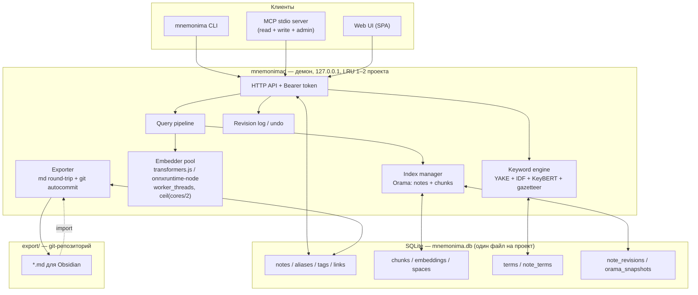

# mnemonima — проектная документация (v0.2)

> Статус: **согласовано, к реализации не приступали.**
> Изменения относительно v0.1 отражают решения, принятые в обсуждении — см. §1.2.
> Документ на русском; всё, что живёт **внутри продукта** (код, схемы, конфиги,
> заметки, UI-строки, логи, коммиты) — только английский, см. §11.

---

## 1. Обзор

### 1.1 Что строим

Локальный движок семантического поиска по персональной базе знаний, организованной
как граф markdown-заметок. Основной потребитель — **AI-агенты**, вторичный — человек
через веб-UI.

Четыре лица одного ядра:

| Лицо | Кому | Форма |
|---|---|---|
| CLI | человеку и скриптам | `mnemonima find -p "project" -q "shaders introducing"` |
| MCP | агентам (Claude Code и др.) | stdio, полный доступ: чтение, запись, администрирование |
| HTTP API | UI, интеграциям | локальный демон на `127.0.0.1` |
| Web UI | человеку | граф, редактор, лаборатория поиска |

### 1.2 Ключевые архитектурные решения

| # | Решение | Обоснование |
|---|---|---|
| **A1** | **SQLite — источник правды.** Тела заметок, метаданные, чанки, векторы, ревизии — всё в одном файле БД на проект. | Транзакции, целостность, один транспортабельный файл, миграции схемы, восстановление после падения. |
| **A2** | **Orama — поисковый слой в RAM**, гидрируется из SQLite при старте демона. | SQLite не умеет гибридный BM25+вектор из коробки; Orama умеет. Разделение «хранение / поиск» — не конфликт, а нормальная связка. |
| **A3** | **Экспорт в md — полноценный round-trip + автокоммит в git.** | Obsidian и git-история как внешний слой, без гонок за источник правды. |
| **A4** | **ID иммутабельны.** Переименования нет. Дополнительные вхождения — в отдельном искомом поле `aliases`. | Ссылка на внешний/несуществующий ID сохраняется как есть: если оператор сослался — была причина. |
| **A5** | **Бэклинки выводятся** из тела заметки, не хранятся как редактируемое поле. | Один источник правды. Материализация во frontmatter — только при экспорте. |
| **A6** | **Мультистратегийный чанкинг:** один текст режется двумя чанкерами (`fine` / `coarse`), поиск идёт по обоим уровням. | Мелкие чанки ловят точные факты, крупные — общий смысл. |
| **A7** | **Векторный поиск — brute-force в Orama, ANN не нужен.** | При потолке в 10k заметок это ~160k чанков → 0.3–0.8 с. Бюджет пользователя — 10 с. Запас десятикратный. |
| **A8** | **Ключевые слова = автоэкстракция + ручной словарь-газеттир.** Три независимых ползунка + глобальный тумблер. | Ручные термины всегда выигрывают, авто — регулируются. |
| **A9** | **MCP с полным доступом** (запись + администрирование) → обязательны ревизии и `undo`. | Прямое следствие A9: агент-соавтор без истории изменений опасен. |
| **A10** | **LRU 1–2 проекта в RAM**, остальные выгружаются по таймауту. | Бюджет 2–4 ГБ. |
| **A11** | **Граф в UI: просмотр + создание связи перетаскиванием.** Удаления рёбер мышью нет. | Создание дописывает ссылку в служебную секцию `## Related` — предсказуемо и обратимо. Удаление требовало бы вырезать wikilink из середины предложения. |
| **A12** | **Вложения — только пути.** Файлы не копируем, не индексируем, в БД не кладём. | «Только md» остаётся буквальным, БД не пухнет, git-экспорт не тащит бинарники. |
| **A13** | **Cross-encoder rerank — post-MVP.** Стадия закладывается в код сразу, включается галочкой, реализация позже. | Пайплайн не придётся переписывать, но и второй модели в памяти на старте нет. |
| **A14** | **Публичный npm, но позже.** Строим по правилам публичного пакета (MIT, semver, строгие дефолты), первые этапы — `npm link`. | Публичный API фиксируется тогда, когда он устоялся, а не на этапе 2. |

### 1.3 Ресурсный бюджет (заданный оператором)

- **Латентность поиска:** до 10 с приемлемо (работа фоновая). Целевая — < 1 с.
- **CPU:** не более половины ядер. `onnxThreads = ceil(cores / 2)`, индексация в
  worker-пуле с пониженным приоритетом (`os.setPriority(PRIORITY_BELOW_NORMAL)`).
- **RAM:** 2–4 ГБ на демон.
- **Масштаб:** старт до 1000 заметок, потолок ~10 000.

---

## 2. Архитектура



### 2.1 Структура репозитория

Монорепа (pnpm workspaces), публикуется одним пакетом `mnemonima`:

```
packages/
  core/      # md-парсер, чанкеры, keyword-движок, embedder, VectorStore, search pipeline
  store/     # SQLite: схема, миграции, репозитории, ревизии
  daemon/    # HTTP, LRU-менеджер проектов, exporter, git
  cli/       # тонкий клиент + автоспавн демона
  mcp/       # MCP stdio adapter поверх HTTP API
  ui/        # Vite SPA, собирается в статику, отдаётся демоном
```

На этапе 0–2 допустимо жить одним пакетом с такой раскладкой директорий и
разрезать позже — граница пакетов уже проведена, разрез механический.

---

## 3. Модель данных

### 3.1 Схема SQLite

Один файл на проект. `PRAGMA journal_mode = WAL`, `foreign_keys = ON`.

```sql
-- ── служебное ───────────────────────────────────────────────────────────
CREATE TABLE meta (
  key   TEXT PRIMARY KEY,        -- schema_version, project_name, id_prefix,
  value TEXT NOT NULL            -- id_counter, active_space, export_path, ...
);

-- ── заметки ────────────────────────────────────────────────────────────
CREATE TABLE notes (
  id         TEXT PRIMARY KEY,   -- 'SL-0042' — ИММУТАБЕЛЕН, переименование запрещено
  title      TEXT NOT NULL,
  body       TEXT NOT NULL,      -- markdown, источник правды
  body_hash  TEXT NOT NULL,      -- sha256 нормализованного тела
  outline    TEXT,               -- generated: оглавление из заголовков
  lang       TEXT NOT NULL DEFAULT 'en',
  status     TEXT NOT NULL DEFAULT 'active',   -- active | draft | archived
  rev        INTEGER NOT NULL DEFAULT 1,
  created_at INTEGER NOT NULL,
  updated_at INTEGER NOT NULL
);

-- «Дополнительные вхождения»: доп. поверхностные формы, участвуют в поиске
CREATE TABLE aliases (
  note_id TEXT NOT NULL REFERENCES notes(id) ON DELETE CASCADE,
  alias   TEXT NOT NULL,
  source  TEXT NOT NULL DEFAULT 'manual',      -- manual | auto
  PRIMARY KEY (note_id, alias)
);
CREATE INDEX idx_aliases_alias ON aliases(alias);

CREATE TABLE tags (
  note_id TEXT NOT NULL REFERENCES notes(id) ON DELETE CASCADE,
  tag     TEXT NOT NULL,
  PRIMARY KEY (note_id, tag)
);

-- ── граф ───────────────────────────────────────────────────────────────
CREATE TABLE links (
  src      TEXT NOT NULL REFERENCES notes(id) ON DELETE CASCADE,
  dst      TEXT NOT NULL,        -- БЕЗ FK: висячие ссылки сохраняются как есть
  anchor   TEXT,                 -- display-текст из [[SL-0042|anchor]] → сигнал для keywords
  heading  TEXT,                 -- якорь из [[SL-0042#Uniforms]]
  kind     TEXT NOT NULL,        -- wikilink | mdlink | manual
  resolved INTEGER NOT NULL,     -- 0 = dst не существует в проекте
  PRIMARY KEY (src, dst, COALESCE(anchor,''))
);
CREATE INDEX idx_links_dst ON links(dst);   -- бэклинки = SELECT src WHERE dst = ?

-- ── словарь терминов ───────────────────────────────────────────────────
CREATE TABLE terms (
  id       INTEGER PRIMARY KEY,
  term     TEXT NOT NULL UNIQUE,
  lemma    TEXT NOT NULL,
  source   TEXT NOT NULL,        -- manual | auto
  pinned   INTEGER NOT NULL DEFAULT 0,   -- ручной, из выдачи не выбивается
  blocked  INTEGER NOT NULL DEFAULT 0,   -- блок-лист мусора
  weight   REAL NOT NULL DEFAULT 1.0,
  df       INTEGER NOT NULL DEFAULT 0,   -- в скольких заметках встречается
  created_at INTEGER NOT NULL
);

CREATE TABLE note_terms (
  note_id TEXT NOT NULL REFERENCES notes(id) ON DELETE CASCADE,
  term_id INTEGER NOT NULL REFERENCES terms(id) ON DELETE CASCADE,
  kind    TEXT NOT NULL,         -- keyword | phrase
  score   REAL NOT NULL,         -- итог фьюжна экстракторов
  source  TEXT NOT NULL,         -- manual | auto
  PRIMARY KEY (note_id, term_id)
);

-- ── пространства эмбеддингов ───────────────────────────────────────────
CREATE TABLE spaces (
  id              TEXT PRIMARY KEY,  -- хеш от {model,dim,prefixes,norm,chunker_ver,strategies}
  model           TEXT NOT NULL,
  dim             INTEGER NOT NULL,
  chunker_version TEXT NOT NULL,
  config_json     TEXT NOT NULL,
  is_active       INTEGER NOT NULL DEFAULT 0,
  created_at      INTEGER NOT NULL
);

CREATE TABLE chunks (
  id           INTEGER PRIMARY KEY,
  space_id     TEXT NOT NULL REFERENCES spaces(id) ON DELETE CASCADE,
  note_id      TEXT NOT NULL REFERENCES notes(id) ON DELETE CASCADE,
  strategy     TEXT NOT NULL,    -- fine | coarse
  ord          INTEGER NOT NULL,
  heading_path TEXT,             -- 'Shaders > Fragment stage'
  kind         TEXT NOT NULL,    -- prose | code
  text         TEXT NOT NULL,
  text_hash    TEXT NOT NULL,    -- ключ переиспользования эмбеддинга
  tokens       INTEGER NOT NULL
);
CREATE INDEX idx_chunks_note ON chunks(space_id, note_id);
CREATE INDEX idx_chunks_hash ON chunks(space_id, text_hash);

-- Ключ (space, text_hash), а НЕ chunk_id: одинаковый текст в разных заметках
-- и в разных стратегиях эмбеддится один раз.
CREATE TABLE embeddings (
  space_id  TEXT NOT NULL REFERENCES spaces(id) ON DELETE CASCADE,
  text_hash TEXT NOT NULL,
  vec       BLOB NOT NULL,       -- Float32Array, dim*4 байт, L2-нормирован
  PRIMARY KEY (space_id, text_hash)
);

-- ── ревизии и снапшоты ─────────────────────────────────────────────────
CREATE TABLE note_revisions (
  note_id    TEXT NOT NULL,
  rev        INTEGER NOT NULL,
  title      TEXT NOT NULL,
  body       TEXT NOT NULL,
  op         TEXT NOT NULL,      -- create | update | delete | import | adopt
  author     TEXT NOT NULL,      -- cli | ui | mcp:<client-name> | import | agent:<id>
  created_at INTEGER NOT NULL,
  PRIMARY KEY (note_id, rev)
);

CREATE TABLE orama_snapshots (
  space_id      TEXT NOT NULL,
  kind          TEXT NOT NULL,   -- notes | chunks
  index_version TEXT NOT NULL,   -- версия схемы индекса пакета
  blob          BLOB NOT NULL,
  created_at    INTEGER NOT NULL,
  PRIMARY KEY (space_id, kind)
);
```

**Опционально:** FTS5-таблица `notes_fts(body, title)` для режима `exact` (grep-подобный
поиск подстроки/regex по телу) и для `doctor`. Основной поиск через неё не идёт.

### 3.2 Маппинг вашей исходной схемы

| Ваше поле | Где живёт | Комментарий |
|---|---|---|
| ID | `notes.id` | иммутабельный, `PREFIX-NNNN` |
| Embedding Model ID | `spaces.model` через `chunks.space_id` | не на заметке, а на пространстве |
| Ключевые слова | `note_terms` (`kind='keyword'`) | manual + auto, §7 |
| Ключевые фразы | `note_terms` (`kind='phrase'`) | manual + auto, §7 |
| Дополнительные вхождения | `aliases` | искомое поле с высоким бустом |
| Embeddings | `embeddings.vec` (BLOB) | многовекторность через `chunks`, §6 |
| Оглавление | `notes.outline` | генерируется из заголовков |
| Ссылаются на меня | `SELECT src FROM links WHERE dst=?` | выводится, не хранится |
| Я ссылаюсь на | `SELECT dst FROM links WHERE src=?` | выводится из тела |
| Текст заметки | `notes.body` | markdown без ограничений |

### 3.3 Идентификаторы

`prefix` — аббревиатура из первых букв названия проекта (2–4 символа, uppercase),
задаётся при `project add`, дальше неизменна. Счётчик — в `meta.id_counter`.

```
"Shader Lab" → SL → SL-0001, SL-0002, ...
```

**Переименование ID запрещено на уровне API.** Единственный способ «переименовать» —
создать новую заметку и вручную перевесить ссылки; движок этому не помогает
намеренно. Дополнительные имена для поиска — через `aliases`.

### 3.4 Ссылки и висячие цели

Парсим из тела: `[[SL-0042]]`, `[[SL-0042 Title]]`, `[[SL-0042|anchor text]]`,
`[[SL-0042#Heading]]`, `[text](SL-0042)`.

**Резолв:** ведущий ID-токен цели → `aliases` → `title`. Первое совпадение выигрывает.

**Висячие ссылки не удаляются и не «чинятся».** `links.resolved = 0`, заметка
индексируется нормально, `doctor` показывает их отдельным списком как информацию,
а не как ошибку. Если оператор сослался на внешний ID — на то была причина.

Обратная связь автоматическая: `mnemonima link A B` создаёт запись, из которой
бэклинк B←A выводится немедленно, без правки заметки B.

---

## 4. Хранение и жизненный цикл проекта

```
~/.mnemonima/
  registry.json           # { "Shader Lab": { dir, db, export } }
  daemon.json             # { pid, port, token, version }
  models/                 # веса transformers.js, общие для всех проектов
  logs/

<project-dir>/
  mnemonima.db            # ЕДИНСТВЕННЫЙ источник правды
  mnemonima.db-wal
  export/                 # git-репозиторий, генерируется, см. §5
    SL-0001 GPU pipeline.md
    SL-0042 Shaders introduction.md
  eval/
    queries.yaml          # golden-набор для тюнинга, §9
```

### 4.1 Гидратация и LRU

При первом запросе к проекту демон:
1. открывает `mnemonima.db`;
2. пытается восстановить Orama из `orama_snapshots` (быстро, ~1–3 с);
3. если снапшота нет или `index_version` устарел — строит индекс из `chunks` +
   `embeddings` и записывает новый снапшот.

Держим в RAM максимум 2 проекта (`daemon.maxHotProjects`), вытеснение по LRU с
таймаутом `projectIdleMin` (по умолчанию 15 мин). Снапшот делает повторную
гидратацию дешёвой, поэтому вытеснение почти незаметно.

**Оценка памяти при 10k заметок / 160k чанков / 384-dim:**

| Компонент | Объём |
|---|---|
| Векторы (Float32) | 160 000 × 384 × 4 = **246 МБ** |
| Текст чанков | ~80 МБ |
| Инвертированный индекс Orama | ~150–250 МБ |
| ONNX-сессия gte-small | ~120 МБ |
| Итого на горячий проект | **~600–700 МБ** |

Два горячих проекта укладываются в бюджет 2–4 ГБ с запасом.

---

## 5. Экспорт в markdown и git

Экспорт — не витрина, а **полноценный round-trip**: `export → правка в Obsidian → import`
восстанавливает всё, кроме производных данных.

### 5.1 Формат файла

Имя: `SL-0042 Shaders introduction.md` — так wikilink `[[SL-0042 Shaders introduction]]`
работает в Obsidian нативно, а наш парсер берёт ведущий ID-токен и не зависит от заголовка.

```yaml
---
# --- authoritative: читается при импорте ---
id: SL-0042
title: Shaders introduction
status: active
rev: 7
created: 2026-08-31T10:12:00Z
updated: 2026-08-31T18:40:00Z
body_hash: sha256:9f2c1a...
tags: [graphics, glsl]
aliases: [shader intro, fragment shading basics]
keywords_manual: [fragment shader, rasterization]
phrases_manual: ["how a fragment shader runs"]

# --- generated: при импорте ИГНОРИРУЕТСЯ и пересчитывается ---
keywords_auto: [uniform, GPU pipeline, interpolation, varying]
phrases_auto: ["per-pixel lighting model", "depth test order"]
outline: |
  1. What a shader is
  2. Vertex vs fragment stage
  3. Uniforms and attributes
links: [SL-0007, SL-0031]
backlinks: [SL-0003, SL-0044]
---

# Shaders introduction

A fragment shader runs once per rasterized pixel. See [[SL-0007 GPU pipeline]]
for the stage before this one.
```

Правило разделения простое и жёсткое: **`*_manual` и всё, что выше разделителя, —
авторитетно; `*_auto`, `outline`, `links`, `backlinks` — производные.** Импорт их
не читает вообще. Это убирает целый класс конфликтов.

### 5.2 Импорт и конфликты

При импорте сверяем `rev` и `body_hash` из frontmatter с БД:

| Ситуация | Действие |
|---|---|
| `rev` совпадает, `body_hash` изменился | обычная правка → новая ревизия в БД |
| `rev` в файле < `rev` в БД, тело различается | **конфликт** |
| `id` неизвестен | новая заметка (ID берётся из файла, если свободен) |
| frontmatter отсутствует | это чужой vault → отправляем в `adopt`, см. §14 |

Политика конфликтов: `--on-conflict ask|db|file|both`. `both` создаёт заметку-дубль
`SL-0042` + `SL-0043 (conflict copy)` со ссылкой друг на друга — ничего не теряется.

### 5.3 Автоэкспорт и git

Демон следит за изменениями в БД и с задержкой (`autoExport.debounceSec`, по умолчанию 60)
выгружает изменённые заметки в `export/` и коммитит:

```
mnemonima: update SL-0042, SL-0007; create SL-0113
```

- `git init` делается при `project add --git`;
- **push никогда не автоматический** — только `mnemonima export --push` руками;
- коммит-сообщения на английском (§11);
- при внешних правках в `export/` (Obsidian) watcher их видит и предлагает
  `mnemonima import` — но **не затягивает автоматически**, чтобы правка на середине
  набора текста не улетела в БД.

### 5.4 Вложения

Картинки, PDF, схемы — **только пути**. Файлы не копируются, не кладутся в БД, не
индексируются.

- В теле остаётся `` или `![[img.png]]` — это markdown,
  трогать его незачем.
- Языковой гейт к именам файлов и `alt` не применяется (это не проза).
- При экспорте пути не переписываются: как оператор написал, так и лежит.
- `doctor` проверяет существование локальных путей и показывает битые отдельным
  списком — как информацию, не как ошибку (ровно как с висячими ссылками, §3.4).
- Диаграммы предпочтительно кодом (mermaid в fenced-блоке): тогда они попадают в
  индекс как текст и участвуют в поиске. Это рекомендация в документации, не гейт.

Следствие: «один транспортабельный файл» верно для всего, что мы порождаем сами;
за внешние ассеты отвечает оператор.

---

## 6. Индексация

```
create/update note
  └─ LANGUAGE GATE (§11) ──fail──> reject (write) / mark non-english (import)
     └─ markdown AST (remark/mdast)
        ├─ links extract          → links
        ├─ outline extract        → notes.outline
        ├─ chunkers × 2           → chunks[fine] + chunks[coarse]
        │    └─ по text_hash: embeddings hit? reuse : embed (worker pool)
        ├─ keyword engine (§7)    → note_terms
        └─ Orama upsert → snapshot (debounce 30 s)
```

### 6.1 Парсинг

`gray-matter` (frontmatter при импорте) + `unified`/`remark` → `mdast`.
AST нужен, чтобы отличать код от прозы, строить breadcrumb заголовков и не резать
чанк посреди таблицы или списка.

### 6.2 Мультистратегийный чанкинг

Один текст режется дважды, оба уровня индексируются в одном пространстве:

| Стратегия | Единица | Целевой размер | Overlap | Ловит |
|---|---|---|---|---|
| `fine` | абзац / элемент списка | ~120 токенов | 0 | точные факты, определения, конкретные утверждения |
| `coarse` | секция под заголовком | ~400 токенов | 15% | общий смысл, тему раздела, связи внутри секции |

Общие правила:
- **Токены считаем токенизатором модели** (transformers.js его отдаёт), а не «слова × 1.3».
  Иначе часть чанков молча обрежется на 512.
- Блоки короче `minTokens` (30) склеиваются с соседями — одна строка это мусорный чанк.
- **Перед эмбеддингом добавляем breadcrumb:** `"Shaders > Fragment stage\n\n<текст>"`.
  Дёшево и заметно поднимает recall — чанк перестаёт быть безымянным абзацем.
- Код-блоки: `kind='code'`, индексируются, но в скоринге идут с понижающим множителем.
- Если `fine` и `coarse` дали идентичный текст (короткая заметка), `text_hash` совпадает
  → эмбеддинг считается один раз, хранится один раз.

Версия чанкера входит в хеш пространства (§6.4): поменяли алгоритм — новое
пространство, старое остаётся для отката.

### 6.3 Эмбеддинги

- `@huggingface/transformers` (v3), backend `onnxruntime-node`.
- Модель по умолчанию: **`Supabase/gte-small`** (ONNX), 384-dim, ctx 512, ~34 МБ.
  Pooling `mean`, `normalize: true` — нормируем при записи, тогда на поиске
  косинус вырождается в скалярное произведение.
- **gte не требует префиксов** `query:` / `passage:` (в отличие от e5/bge). Поэтому в
  описании модели держим поля `queryPrefix` / `docPrefix` — при подключении
  `bge-small-en-v1.5` они заполняются, код не меняется.
- Батч 16–32 чанка, worker-пул на `ceil(cores/2)` потоков, приоритет процесса понижен.

Реестр моделей (расширяемый):

| id | dim | ctx | вес | заметка |
|---|---|---|---|---|
| `Supabase/gte-small` | 384 | 512 | ~34 МБ | дефолт |
| `Xenova/bge-small-en-v1.5` | 384 | 512 | ~34 МБ | нужен `queryPrefix` |
| `Xenova/all-MiniLM-L6-v2` | 384 | 256 | ~23 МБ | быстрее, слабее |
| `Xenova/gte-base` | 768 | 512 | ~110 МБ | точнее, вдвое дороже по RAM |
| `nomic-ai/nomic-embed-text-v1.5` | 768* | 8192 | ~140 МБ | Matryoshka, dim усекается |

### 6.4 Пространства эмбеддингов

`spaces.id = hash({model, dim, queryPrefix, docPrefix, normalization, chunkerVersion, strategies})`.

Любое изменение любого из этих параметров даёт **новое пространство** — автоматически,
без ручных миграций и без «а почему поиск сломался после апдейта». Пространства
сосуществуют:

1. фоново строим новое (прогресс через SSE в UI);
2. атомарно переставляем `spaces.is_active`;
3. старое остаётся для мгновенного отката или удаляется командой.

Это то место, на котором такие проекты обычно ломаются через полгода. Заложить сразу.

### 6.5 Инкрементальность

Хеш считается от **текста чанка**, а не от позиции. Правка одного абзаца в большой
заметке переэмбеддит 1–2 чанка (по одному на стратегию), остальные переиспользуются,
даже если границы сдвинулись. Разница между «мгновенно» и «полминуты на каждое
сохранение».

---

## 7. Ключевые слова, фразы и словарь проекта

Две разные задачи, нужны обе.

### 7.1 Извлечение из документа

**Ступень 1 — кандидаты.** POS-разметка через `wink-pos-tagger` (чистый JS, без загрузки
моделей). Именные группы по шаблону `(JJ|NN)*NN+` на 1–4-граммах. Это ваша идея с
существительными, но **с учётом контекста**: `render` как глагол отсеивается, как
существительное — остаётся. Плюс RAKE-подобные последовательности между стоп-словами
как запасной источник кандидатов.

**Ступень 2 — скоринг.** Фьюжн рангов (RRF либо z-нормированная взвешенная сумма) из
четырёх независимых сигналов:

| Сигнал | Что даёт | Стоимость |
|---|---|---|
| **YAKE** | Внутридокументная значимость: регистр, позиция, нормированная частота, разброс соседей, разброс по предложениям. Работает на одной заметке, корпус не нужен. Поддерживаемого JS-порта нет — **реализуем сами, спецификация простая (~150 строк)**, зато без мёртвой зависимости. | ~ms |
| **BM25 / IDF по корпусу проекта** | Единственный сигнал, отвечающий «насколько термин *отличает* эту заметку от остальных». Именно он убивает `system`, `thing`, `way`, которые словарь существительных подсунул бы в топ. Корпус у нас есть, IDF бесплатный. | ~0 |
| **KeyBERT / EmbedRank** | Косинус между вектором документа и векторами фраз-кандидатов. Эмпирически сильнейший из unsupervised-семейства. **Для нас почти бесплатен: gte-small уже в памяти**, один проход по ~100 кандидатам — единицы миллисекунд. | ~ms |
| **Структурные бусты** | `title`, H1–H3, **bold**, `` `code` ``, `tags`, и главное — **display-текст входящих wikilink'ов**. Если три заметки ссылаются как `[[SL-0042\|shader basics]]`, то «shader basics» — это то, как корпус *сам* называет заметку. Сильнейший сигнал, никакого NLP не требует. | ~0 |

**Ступень 3 — постобработка.** Лемматизация (`wink-lemmatizer`), схлопывание вложенных
фраз (предпочитаем длинную при достаточной поддержке), MMR-диверсификация, отсечка.

Результат: `keywords` (1–2 слова) и `phrases` (3+ слова) в `note_terms`.

### 7.2 Словарь проекта

Так устроены реальные term-mining пайплайны: извлечь по документу → агрегировать по
корпусу → **промотировать** частые и высокоскоринговые термины в словарь проекта.

- Термин с `df ≥ promoteMinDf` и `score ≥ promoteMinScore` попадает в UI как
  **кандидат** — оператор его подтверждает (`pinned=1`) либо блокирует (`blocked=1`).
- **Ручные термины всегда выигрывают:** максимальный вес, автоотсечка их не трогает,
  из выдачи не выбиваются.
- Ручной словарь работает как **газеттир**: на индексации гоняем Aho–Corasick по телу
  заметки, и ваши термины матчатся точно, независимо от того, что решил экстрактор.
- **Блок-лист** для мусора; кандидатов в него движок предлагает сам (высокий DF, низкий IDF).
- Бонус: словарь бесплатно переиспользуется на поиске как **query expansion** по
  синонимам/алиасам. Второй, неочевидный выигрыш от того, что вы его ведёте руками.

### 7.3 Ручки (все четыре независимы, как вы просили)

```jsonc
"keywords": {
  "autoEnabled": true,       // глобальный тумблер автоэкстракции
  "topNKeywords": 12,        // 0…30 — сколько автотерминов оставить
  "topNPhrases":  6,         // 0…20
  "minScore": 0.35,          // 0…1 — порог уверенности фьюжна
  "autoWeight": 1.0,         // 0…1 — множитель авто относительно ручных при ранжировании
  "promoteMinDf": 3,
  "promoteMinScore": 0.5,
  "useLinkAnchors": true
}
```

`autoEnabled: false` → остаются только ручные термины и газеттир. `autoWeight: 0` →
автотермины видны в UI, но на поиск не влияют. Это разные вещи, поэтому и ручки разные.

---

## 8. Поиск

### 8.1 Индексы Orama

Два индекса на активное пространство, оба в RAM:

```js
// chunks — основной retrieval
{
  chunkId: 'string', noteId: 'string',
  strategy: 'enum',            // fine | coarse
  headingPath: 'string',
  text: 'string',
  kind: 'enum',                // prose | code
  embedding: 'vector[384]'
}

// notes — метаданные, фильтры, бусты, граф
{
  id: 'string', title: 'string',
  keywordsManual: 'string[]', keywordsAuto: 'string[]',
  phrasesManual: 'string[]',  phrasesAuto: 'string[]',
  aliases: 'string[]', tags: 'string[]', outline: 'string',
  links: 'string[]', backlinks: 'string[]',
  degree: 'number', updated: 'number', status: 'enum'
}
```

> Синтаксис Orama по памяти (`'vector[384]'`, `mode: 'hybrid'`, `hybridWeights`).
> На старте реализации сверить с версией в `package.json` — в v3 `create` синхронный,
> в v2 асинхронный.

### 8.2 Пайплайн запроса

```
query
 ├─ 0. LANGUAGE GATE — не-английский запрос отклоняется (§11)
 ├─ 1. NORMALIZE — лемматизация, фразы в кавычках, фильтры (tag:, id:, after:, status:)
 ├─ 2. EXPAND — синонимы из словаря проекта (опционально, ползунок)
 ├─ 3. EMBED QUERY — 1 вектор, ~5–15 мс
 ├─ 4. RETRIEVE
 │      a) chunks: Orama mode:'hybrid' (BM25 + cosine) → top-K (K≈150)
 │      b) notes:  Orama mode:'fulltext' по title/keywords/phrases/aliases → top-K
 ├─ 5. FUSE → скор на уровне заметки
 │      perStrategy(s) = max(chunkScore | strategy=s)
 │      chunkPart = Σ_s w_s · perStrategy(s) + λ·log(1 + |chunks над порогом|)
 │      score = w_chunk · chunkPart + w_meta · noteScore
 ├─ 6. GRAPH — буст по соседству + expansion (§8.4)
 ├─ 7. RERANK — рекенси, degree-приор, pin/boost, опц. cross-encoder
 ├─ 8. DIVERSIFY — MMR, чтобы топ не был пятью чанками одной заметки
 └─ 9. RENDER — сниппеты, `why`-разбор скора, бюджет токенов для агента
```

Логарифм в пункте 5: заметка с пятью релевантными чанками должна выигрывать у заметки
с одним, но не должна побеждать чистой суммой только за счёт длины.

### 8.3 Режимы

| Режим | Что делает | Когда |
|---|---|---|
| `hybrid` (default) | всё вышеописанное | обычный поиск |
| `semantic` | только векторы | «как GPU считает пиксели» |
| `lexical` | только BM25 | точные термины, имена API |
| `exact` | подстрока/regex по телу (FTS5) | grep-режим |
| `graph` | обход от заданной ноты | `--from SL-0042 --depth 2` |
| `id` | прямой lookup | дешёвый вызов для агента |

### 8.4 Graph-aware ранжирование

У вас есть граф — странно не использовать его при поиске. Два хода после первичного ретрива:

1. **Буст по соседству.** Заметка, чьи соседи тоже в топе, вероятно в центре
   релевантного кластера. Одна итерация: `score += μ · Σ(score соседей) / degree`.
2. **Expansion.** Заметка, которая сама не нашлась, но на неё ссылаются ≥`minVotes`
   топовых хитов — кандидат в выдачу с пометкой `via: [SL-0007, SL-0031]`. Ловит
   случаи, где терминология другая, а смысл тот же.

Для агентов ключевой флаг `--expand-links 1`: вернуть найденные заметки **плюс их
прямых соседей в сжатом виде**. Агент получает связный подграф за один вызов вместо
трёх round-trip'ов. Это прямое следствие того, что у вас граф, а не плоский набор
документов, — и главное отличие от «ещё одного локального RAG».

### 8.5 Настраиваемые параметры

```jsonc
"search": {
  "mode": "hybrid",
  "hybridWeights": { "text": 0.5, "vector": 0.5 },
  "strategyWeights": { "fine": 1.0, "coarse": 0.9 },
  "fusion": { "chunk": 0.7, "meta": 0.3, "lambdaMultiChunk": 0.15 },
  "boost": {
    "title": 3.0, "aliases": 2.5,
    "keywordsManual": 2.5, "keywordsAuto": 1.5,
    "phrasesManual": 2.0,  "phrasesAuto": 1.2,
    "outline": 1.5, "text": 1.0, "code": 0.5
  },
  "graph":  { "boost": 0.15, "expandDepth": 1, "expandMinVotes": 2 },
  "rerank": { "recencyHalfLifeDays": 0, "degreePrior": 0, "crossEncoder": false },
  "mmr":    { "enabled": true, "lambda": 0.7 },
  "expand": { "synonyms": true },
  "limits": { "candidateK": 150, "resultK": 10, "minSimilarity": 0.25 },
  "tolerance": 1
}
```

Пресеты `precise` / `balanced` / `recall` / `agent` — чтобы не заставлять крутить 20 ручек.

### 8.6 Объяснимость

Каждый хит несёт разбор скора: вклад `text`, `vector`, `meta`, `graph`, какая стратегия
дала лучший чанк, какие термины сматчились. Без этого настройка весов в UI —
шаманство, а вопрос «почему эта заметка не нашлась» — неразрешим. Стоит копейки,
окупается постоянно.

### 8.7 Производительность

При 160k чанков × 384 dim один запрос — это 61M умножений-сложений по `Float32Array`.
В JS это ориентировочно 60–200 мс, плюс BM25 и постобработка → **0.3–0.8 с**. Бюджет
пользователя 10 с, запас десятикратный. **ANN не требуется.**

Интерфейс `VectorStore` (`search(vec, k, filter) → hits`) закладывается всё равно,
но реализация одна — Orama. Если когда-то понадобится, за ним прячется
`hnswlib-node` или `sqlite-vec`, и поиск переписывать не придётся.

---

## 9. Eval-харнесс

Без него «поиграться с весами в UI» даёт локальный оптимум под последний запрос,
который вы проверяли.

`eval/queries.yaml`:

```yaml
- q: "how a fragment shader runs"
  relevant: [SL-0042, SL-0007]
- q: "uniform buffer layout rules"
  relevant: [SL-0031]
  irrelevant: [SL-0002]      # опционально: явные негативы
```

`mnemonima eval -p proj` прогоняет набор и считает `recall@5`, `MRR`, `nDCG@10`,
`p50/p95` латентности. `mnemonima eval --tune` делает random/grid search по весам
(`hybridWeights`, `strategyWeights`, `fusion`, `boost`, `graph.boost`) и выводит
лучшую конфигурацию с дельтой к текущей. Результаты прогонов пишутся в БД, в UI
видна история — стало лучше или хуже после правки.

UI подсказывает: набор моложе 20 запросов — метрики шумные, доверять рано.

---

## 10. Демон, API, MCP

### 10.1 Жизненный цикл

1. CLI читает `~/.mnemonima/daemon.json`.
2. Живой демон нужной версии (`GET /health`)? → шлём запрос.
3. Нет / версия не та → спавним `mnemonimad` detached, ждём готовности (poll, таймаут 15 с).
4. Демон гасится по `idleTimeoutMin` (30). Явно — `mnemonima daemon stop`.

Транспорт: **HTTP на `127.0.0.1`, случайный порт**. Один сервер обслуживает CLI, MCP
и UI; SSE для прогресса индексации бесплатно; отлаживается через `curl`. Защита:
жёсткий bind на loopback, `Bearer`-токен из `daemon.json` (права 600), проверка `Origin`
для браузерных запросов. Фреймворк — Hono (`@hono/node-server`).

### 10.2 HTTP API

```
GET    /health
GET    /projects
POST   /projects/:p/search
GET    /projects/:p/notes/:id                 ?withNeighbors=1
POST   /projects/:p/notes                     создание, ID автогенерируется
PUT    /projects/:p/notes/:id                 if-match по rev
DELETE /projects/:p/notes/:id                 soft: status=archived
GET    /projects/:p/notes/:id/revisions
POST   /projects/:p/notes/:id/revert          { rev }
POST   /projects/:p/links                     { src, dst, anchor? }
DELETE /projects/:p/links
GET    /projects/:p/graph
GET    /projects/:p/terms                     словарь + кандидаты на промоцию
POST   /projects/:p/terms                     pin / block / add manual
POST   /projects/:p/reindex                   { full?, model? }
POST   /projects/:p/spaces/:id/activate
POST   /projects/:p/export                    { push? }
POST   /projects/:p/import                    { onConflict }
POST   /projects/:p/eval                      { tune? }
GET    /projects/:p/events                    SSE
GET    /ui/*
```

### 10.3 MCP-сервер

Полный доступ (чтение + запись + администрирование), как решено.

| Тул | Категория |
|---|---|
| `mnemonima_list_projects`, `mnemonima_search`, `mnemonima_get_note`, `mnemonima_neighbors`, `mnemonima_list_terms` | чтение |
| `mnemonima_create_note`, `mnemonima_update_note`, `mnemonima_link`, `mnemonima_unlink`, `mnemonima_add_term` | запись |
| `mnemonima_reindex`, `mnemonima_switch_model`, `mnemonima_set_weights`, `mnemonima_run_eval`, `mnemonima_export` | администрирование |

**Обязательные следствия полного доступа** (иначе один плохой прогон агента засоряет граф):

1. **Каждая запись — новая ревизия** в `note_revisions` с `author='mcp:<client>'`.
   `mnemonima history` / `revert` работают всегда.
2. **Пакетный undo:** каждая MCP-сессия получает `batch_id`; `mnemonima undo --batch <id>`
   откатывает всё, что агент сделал за сессию, одной командой.
3. **Деструктивные операции за флагом.** `delete_note` (hard), `delete_space`,
   `reindex --full` с другой моделью требуют `mcp.allowDestructive: true` в конфиге.
   По умолчанию выключено, `soft delete` (архивация) доступна всегда.
4. **Языковой гейт применяется к записи от агента** ровно так же, как к записи от человека.
5. **Проектный скоуп:** `mnemonima mcp -p proj` привязывает сессию к одному проекту,
   кросс-проектная запись невозможна.
6. **Автоэкспорт даёт бесплатный аудит:** git-история показывает, что именно агент
   написал, построчно.

---

## 11. English-only гейты

Три слоя, применяются и к заметкам, и к запросам, и к записи через MCP.

**Слой 1 — script gate (жёсткий, дешёвый, детерминированный).**
Доля кодпоинтов в не-латинских письменностях через Unicode property escapes
(`/\p{Script=Cyrillic}/u`, Han, Hiragana, Katakana, Hangul, Arabic, Hebrew, Greek,
Devanagari). Любая кириллица или CJK в теле → **reject**.

Важно: гейт бьёт по **письменностям**, а не по «не-ASCII». Разрешаем `— – ' " × ° ≈ ½`,
диакритику в именах собственных (`Gouraud`, `Björk`), эмодзи, математику. Иначе
получим ложные срабатывания на нормальном английском.

**Слой 2 — language detect (мягкий).** `franc-min` на тексте длиннее ~40 символов.
Не `eng` → warning или reject по настройке `language.gate: strict|warn|off`.
Латиница + не-английский (немецкий, испанский) ловится только здесь.

**Слой 3 — исключения.** Внутри fenced code blocks гейт ослаблен по умолчанию
(`gateCodeBlocks: false`) — в коде бывают строковые литералы на любом языке.

**Поведение:**
- **запись** (CLI/UI/MCP) → отказ с указанием позиции нарушения;
- **импорт** → заметка помечается `lang != 'en'`, не индексируется, попадает в `doctor`,
  остальной импорт не падает;
- **поиск** → `mnemonima find -q "шейдеры"` → ошибка `query must be in English`.

Гейт защищает качество ретрива (gte-small на русском даёт мусорные векторы), а не
идеологию. Если когда-нибудь понадобится второй язык — это отдельное пространство
эмбеддингов с мультиязычной моделью, а не смешение в одном индексе. Архитектурно
уже возможно (§6.4), просто выключено.

---

## 12. CLI

```bash
# проекты
mnemonima project add "Shader Lab" --dir W:/kb/shaders --prefix SL --git
mnemonima project list | remove <name>

# поиск
mnemonima find -p "Shader Lab" -q "shaders introducing"
mnemonima find -p SL -q "..." --mode semantic --limit 20 --json
mnemonima find -p SL -q "..." --preset recall --weights text=0.3,vector=0.7
mnemonima find -p SL --from SL-0042 --depth 2
mnemonima find -p SL -q "..." --expand-links 1 --budget-tokens 2000 --why

# заметки
mnemonima new -p SL --title "Shaders introduction" [--body-file x.md]
mnemonima get -p SL SL-0042 [--json] [--with-neighbors]
mnemonima edit -p SL SL-0042            # $EDITOR, запись через API
mnemonima link -p SL SL-0042 SL-0007 [--anchor "shader basics"]
mnemonima alias add -p SL SL-0042 "shader intro"
mnemonima history -p SL SL-0042
mnemonima revert -p SL SL-0042 --rev 5
mnemonima undo -p SL --batch <batch-id>

# словарь
mnemonima terms list -p SL [--candidates]
mnemonima terms pin|block|add -p SL "fragment shader"

# индекс и модели
mnemonima index -p SL [--full]
mnemonima models list | pull <id>
mnemonima space build -p SL --model Xenova/gte-base
mnemonima space activate -p SL <space-id>
mnemonima doctor -p SL [--fix]
mnemonima stats -p SL

# md-мост
mnemonima export -p SL [--push]
mnemonima import -p SL [--on-conflict ask|db|file|both]

# качество
mnemonima eval -p SL [--tune]

# сервисы
mnemonima ui [-p SL]
mnemonima mcp -p SL
mnemonima daemon status|stop|restart|logs
```

### 12.1 Контракт для агентов

- `--json` → стабильная схема, детерминированный порядок (тайбрейк по `id`), без ANSI.
- При `--json` в stdout идёт **только JSON**, вся диагностика — в stderr.
- `--budget-tokens` обрезает сниппеты под бюджет контекста.
- Коды выхода: `0` ok, `1` not found, `2` bad request, `3` language gate, `4` daemon unavailable.

```json
{
  "query": "shaders introducing",
  "project": "Shader Lab",
  "mode": "hybrid",
  "took_ms": 340,
  "hits": [
    {
      "id": "SL-0042",
      "title": "Shaders introduction",
      "score": 0.871,
      "why": { "text": 0.31, "vector": 0.44, "meta": 0.09, "graph": 0.03,
               "bestStrategy": "fine", "matchedTerms": ["fragment shader"] },
      "snippets": [
        { "headingPath": "Shaders > Fragment stage", "strategy": "fine",
          "text": "A **fragment shader** runs once per rasterized pixel...",
          "score": 0.88 }
      ],
      "links": ["SL-0007"], "backlinks": ["SL-0003"],
      "via": null
    }
  ]
}
```

---

## 13. Web UI

`mnemonima ui [-p proj]` поднимает демон и открывает `http://127.0.0.1:<port>/ui?token=…`.

1. **Projects** — реестр, статистика, добавление проекта.
2. **Graph** — force-directed граф. **graphology + sigma.js** (WebGL, тянет 10k+ узлов);
   размер узла = degree, цвет = кластер (Louvain), результаты поиска подсвечиваются
   прямо на графе, висячие ссылки — пунктиром в «фантомные» узлы.

   **Создание связи перетаскиванием** (см. §13.1). Удаления рёбер мышью нет —
   связь убирается только правкой тела в редакторе.
3. **Note editor** — CodeMirror 6, сплит-preview, автокомплит `[[` по ID/title/alias,
   панель бэклинков, ручные термины отдельным полем от авто, кнопка «regenerate».
4. **Search lab** — главный экран настройки: запрос слева, все ручки §8.5 и §7.3,
   результаты справа с разбором `why` на каждый хит, **live re-rank без переиндексации**.
5. **Terms** — словарь проекта: ручные, авто, кандидаты на промоцию, блок-лист.
6. **Spaces** — пространства эмбеддингов, сборка новым моделью с прогрессом (SSE),
   переключение активного, откат.
7. **Eval** — golden-набор, метрики, история прогонов, `--tune`.
8. **Health** — отчёт `doctor` + журнал ревизий с фильтром по автору (видно, что
   написал агент).

Сборка: Vite, статика вшита в npm-пакет, отдаётся демоном. Отдельного dev-сервера в проде нет.

### 13.1 Создание связи перетаскиванием

Единственная мутирующая операция на графе. Требование к ней одно: **никогда не
трогать осмысленный текст заметки.**

Механика:
1. Пользователь тянет от узла A к узлу B → диалог подтверждения с превью строки,
   которая будет дописана, и полем для anchor-текста (необязательное).
2. В теле A ищется секция `## Related`. Нет — создаётся в самом конце тела.
3. В неё дописывается пункт списка: `- [[SL-0007 GPU pipeline]]` (или
   `- [[SL-0007 GPU pipeline|anchor text]]`, если anchor задан).
4. Запись идёт через обычный API `PUT /notes/:id` → новая ревизия, `undo` работает,
   автоэкспорт коммитит изменение в git.

Почему именно `## Related`, а не вставка в текст: положение ссылки внутри абзаца
несёт смысл, и угадать его невозможно. Отдельная секция в конце — предсказуемо,
диффабельно, тривиально откатывается, и Obsidian показывает её как нормальные
исходящие ссылки.

Дубли не создаются: если ребро A→B уже есть (в любом виде — в прозе или в `Related`),
диалог сообщает об этом и предлагает только сменить anchor.

Направление задаётся направлением перетаскивания. Бэклинк на B появляется сам,
из `links` (§3.4) — заметку B мы не трогаем.

---

## 14. Post-MVP

Две фичи, решение по которым принято, но реализация отложена. Записаны здесь, чтобы
архитектура их не заблокировала и чтобы они не потерялись.

### 14.1 adopt — импорт чужого Obsidian-хранилища

> Внедряем **сильно позже**, после стабилизации ядра, поиска и UI.

**Задача:** затянуть существующий vault, где нет наших ID, а ссылки идут по именам
файлов и заголовкам.

**Что придётся решить:**

1. **Раздача ID.** Каждой заметке присваивается `PREFIX-NNNN` в детерминированном
   порядке (по пути + имени, чтобы повторный прогон дал тот же результат).
2. **Резолв ссылок по именам.** `[[GPU pipeline]]` → ищем файл с таким basename,
   затем по заголовку H1, затем по алиасам Obsidian (`aliases:` во frontmatter).
   Неоднозначности (два файла с одним именем в разных папках) — в отчёт, не гадаем.
3. **Сохранение исходного имени.** Оригинальный basename попадает в `aliases` —
   поиск по старым именам продолжает работать, внешние ссылки не протухают.
4. **Языковой гейт на массиве.** Часть чужого vault наверняка не на английском.
   Режимы: `--skip-non-english` (по умолчанию), `--import-anyway` (заметки попадают
   в БД со `status='archived'` и не индексируются).
5. **Синтаксис Obsidian, который мы не поддерживаем:** embeds `![[note]]`, блочные
   ссылки `^block-id`, Dataview-запросы, callouts, вложения. Политика: **сохраняем в
   теле как есть** (это markdown), но не интерпретируем; `doctor` показывает список.
6. **Вложения.** Картинки и PDF не индексируются, но пути в теле сохраняются;
   опционально копируем в `export/attachments/`.
7. **Идемпотентность.** Повторный `adopt` того же vault не должен плодить дубли —
   сверка по `body_hash` и сохранённому оригинальному пути.
8. **Dry-run обязателен.** `mnemonima adopt <path> --dry-run` печатает отчёт:
   сколько заметок, сколько ссылок разрешилось, сколько нет, сколько не-английских,
   какие коллизии имён. Только после этого реальный прогон.

**Оценка:** это самостоятельная фича на несколько дней, с собственным набором тестов
на грязных данных. Не смешивать с обычным `import` (§5.2), который работает **только**
с нашим frontmatter.

### 14.2 Cross-encoder rerank

**База закладывается в коде сразу, реализация — когда-нибудь потом.**

Идея: bi-encoder (gte-small) кодирует запрос и чанк независимо, поэтому не видит их
взаимодействия. Cross-encoder прогоняет пару `(query, chunk)` через модель совместно
и выдаёт скор релевантности напрямую. На top-20 это заметно точнее любого тюнинга
весов, но дороже: `Xenova/ms-marco-MiniLM-L-6-v2`, ~50–150 мс на 20 пар, +~90 МБ RAM.

Что делается **сейчас** (этап 2):

- Стадия 7 пайплайна (§8.2) оформляется как pluggable-интерфейс:
  ```ts
  interface Reranker {
    id: string
    rerank(query: string, hits: Hit[], signal: AbortSignal): Promise<Hit[]>
  }
  ```
- Регистрируется одна реализация — `NoopReranker`, возвращающая вход без изменений.
- В конфиге живёт `search.rerank.crossEncoder: false`, в UI — галочка,
  задисейбленная с подписью «not implemented yet».
- Вклад реранкера уже предусмотрен в разборе `why` (§8.6) как отдельное поле.

Что делается **потом**: `CrossEncoderReranker` — вторая ONNX-сессия, ленивая загрузка
при первом включении галочки, свой worker, отмена по `AbortSignal`. Регистрация в
том же реестре, остальной пайплайн не меняется ни строкой.

Проверять эффект — через eval-харнесс (§9): прогон с галочкой и без, дельта по
`nDCG@10`. Если прироста нет — фича остаётся выключенной, и это нормальный исход.

---

## 15. Этапы

| Этап | Содержание | Критерий готовности |
|---|---|---|
| **0. Скелет** | pnpm-монорепа, TS, tsup, vitest, CLI-каркас, SQLite-схема + миграции | `mnemonima project add` создаёт БД |
| **1. Ядро индексации** | md-парсер, языковой гейт, два чанкера, embedder-пул, `spaces`, кеш по `text_hash` | `index` + `find --mode semantic` на 100 заметках |
| **2. Гибрид** | Orama notes+chunks, фьюжн стратегий, бусты, `--json`, `--why` | `find --mode hybrid` со стабильной схемой |
| **3. Граф** | парсинг ссылок, бэклинки, висячие цели, `link`, graph-буст, expansion, `doctor` | `--expand-links 1` возвращает подграф |
| **4. Термины** | YAKE + IDF + KeyBERT + структурные, газеттир, словарь, промоция, 4 ручки | `terms list --candidates` осмысленен |
| **5. Демон** | HTTP, автоспавн, LRU-проекты, снапшоты Orama, ревизии, undo | второй `find` < 1 с, гидратация < 3 с |
| **6. md-мост** | export с round-trip frontmatter, import с конфликтами, git-автокоммит | цикл export→Obsidian→import без потерь |
| **7. MCP** | все три группы тулзов, `batch_id`, `allowDestructive`, скоуп по проекту, **демон забирает путь записи** (см. 15.1) | Claude Code видит и использует тулзы; автоэкспорт работает |
| **8. UI** | projects → graph → editor → search lab → terms → spaces → eval → health | тюнинг весов вживую с `why` |
| **9. Eval** | golden-набор, recall@k / MRR / nDCG, `--tune`, история прогонов | цифры вместо ощущений |
| **10+. Post-MVP** | `adopt` (§14.1), cross-encoder rerank (§14.2) | dry-run на чужом vault не врёт; галочка rerank даёт прирост nDCG или честно не даёт |

Этапы 1–3 дают работающий поисковик; 5–7 — работающий инструмент для агента;
8–9 — управляемое качество.

### 15.1 Что этап 7 закрыл

Долг, накопленный к концу этапа 6, упирался в одно: **демон не владел путём
записи**. Теперь владеет. Ниже — где каждый пункт приземлился.

1. **Автоэкспорт работает.** Каждый эндпоинт записи ставит отложенный экспорт,
   демон его коммитит. Два правила против неожиданностей: `export.enabled`
   должен быть включён, и **директория экспорта должна уже существовать** — мы
   поддерживаем vault в актуальном состоянии, а не создаём его потому, что агент
   написал заметку. Отложенный экспорт сбрасывается при остановке демона, а
   явный `export` отменяет отложенный, а не гонится с ним.

2. **Push остался ручным.** Демон коммитит и никогда не пушит, а тул
   `mnemonima_export` вообще не предлагает такой опции.

3. **Git остался бинарником.** Демон переиспользует тот же `git.ts`; ради
   фонового коммита библиотека не заводилась. `mnemonima.db` по-прежнему в
   сгенерированном `.gitignore`.

4. **Удаление ручного термина осталось явным.** `mnemonima_remove_term` — свой
   отдельный тул, и он деструктивный: отказывает, пока не включён
   `mcp.allowDestructive`. Обратимая форма — `mnemonima_block_term`, и описания
   тулзов прямо советуют её.

5. **Ревизии говорят о происхождении.** Записи агента ложатся как
   `author: mcp:<client>` с одним `batchId` на сессию, который печатается при
   старте, — оператор откатывает весь прогон одной командой.


---

## 16. Риски и как их закрываем

| Риск | Митигация |
|---|---|
| Гидратация Orama на 160k чанков занимает десятки секунд | Снапшот `@orama/plugin-data-persistence` в BLOB-таблице; полная пересборка только при смене `index_version` |
| Агент через MCP засоряет граф | Ревизии на каждую запись, `undo --batch`, деструктив за флагом, git-история как аудит (§10.3) |
| Мультистратегийный чанкинг удваивает стоимость индексации | Дедуп по `text_hash` (короткие заметки дают идентичные чанки), worker-пул, приоритет ниже нормального |
| Смена модели/чанкера ломает индекс | Пространства эмбеддингов с хешем конфигурации, сосуществование, атомарное переключение, откат (§6.4) |
| Конфликты export↔import | `*_manual` авторитетны, `*_auto` игнорируются при импорте; сверка `rev`+`body_hash`; `--on-conflict both` не теряет данные (§5.2) |
| Индексация вешает машину | `ceil(cores/2)` потоков, `PRIORITY_BELOW_NORMAL`, батчинг, отменяемость задач |
| Тюнинг весов вслепую | `why` на каждом хите + eval-харнесс с метриками (§8.6, §9) |
| Ползучий рост vault за 10k заметок | Интерфейс `VectorStore` заложен; замена на `hnswlib-node`/`sqlite-vec` локальна |
| Мёртвые NLP-зависимости | YAKE реализуем сами (~150 строк); из внешнего только `wink-pos-tagger`, `wink-lemmatizer`, `franc-min` — все живые и мелкие |

---

## 17. Публикация и версионирование

Целимся в **публичный npm-пакет, но публикуемся позже** — когда CLI и JSON-схема
выдачи устоятся. До этого разработка идёт через `npm link` / `pnpm link --global`.

Практически это значит, что уже сейчас строим по правилам публичного пакета:

- **Лицензия MIT**, `LICENSE` в корне, `author` и `repository` в `package.json`.
- **Semver с самого начала**, версии `0.x` до первого публичного релиза. Ломающие
  изменения CLI-флагов и JSON-схемы фиксируются в `CHANGELOG.md` даже до публикации —
  иначе к моменту релиза восстановить историю будет нечем.
- **Строгие дефолты безопасности**, а не «у меня же локально»: bind только на
  `127.0.0.1`, токен обязателен, `mcp.allowDestructive: false`, автопуш в git
  выключен, телеметрии нет вообще.
- **`files`** в `package.json` — только `dist/` и собранный UI. Ни `.db`, ни весов
  моделей, ни тестовых vault'ов в пакете.
- **Модели не вшиваются в пакет.** Веса тянутся при первом запуске в
  `~/.mnemonima/models/` — иначе `npm i -g` весит 40 МБ. Команда
  `mnemonima models pull` для офлайн-подготовки.
- **`engines.node: ">=20"`** — нужен для стабильного `node:sqlite` / `better-sqlite3`
  и современного `worker_threads`.
- **CI:** сборка + тесты + typecheck на Windows и Linux. Windows обязателен: проект
  разрабатывается на нём, а пути, права на файлы и приоритеты процессов — самая
  частая причина расхождений.
- **Публичный API-контракт** (то, что после релиза ломать нельзя): CLI-флаги, JSON-схема
  `find`, набор и сигнатуры MCP-тулзов, схема frontmatter экспорта. Всё остальное —
  внутреннее и меняется свободно.

Что откладываем до самой публикации: README на английском с примерами, бейджи,
`npm publish --access public`, GitHub Actions на релиз по тегу.

---

## 18. Статус решений

Все вопросы, поднятые при разборе технического видения, закрыты. Открытых блокеров нет.
Ближайший шаг — этап 0 из §15: монорепа, TypeScript, схема SQLite с миграциями,
каркас CLI.
